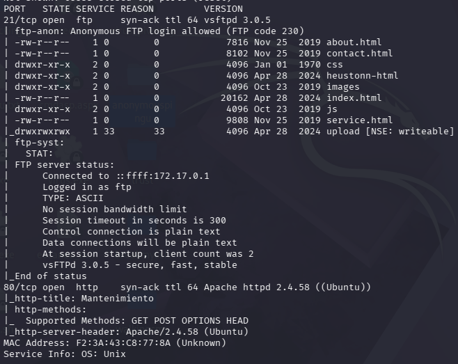
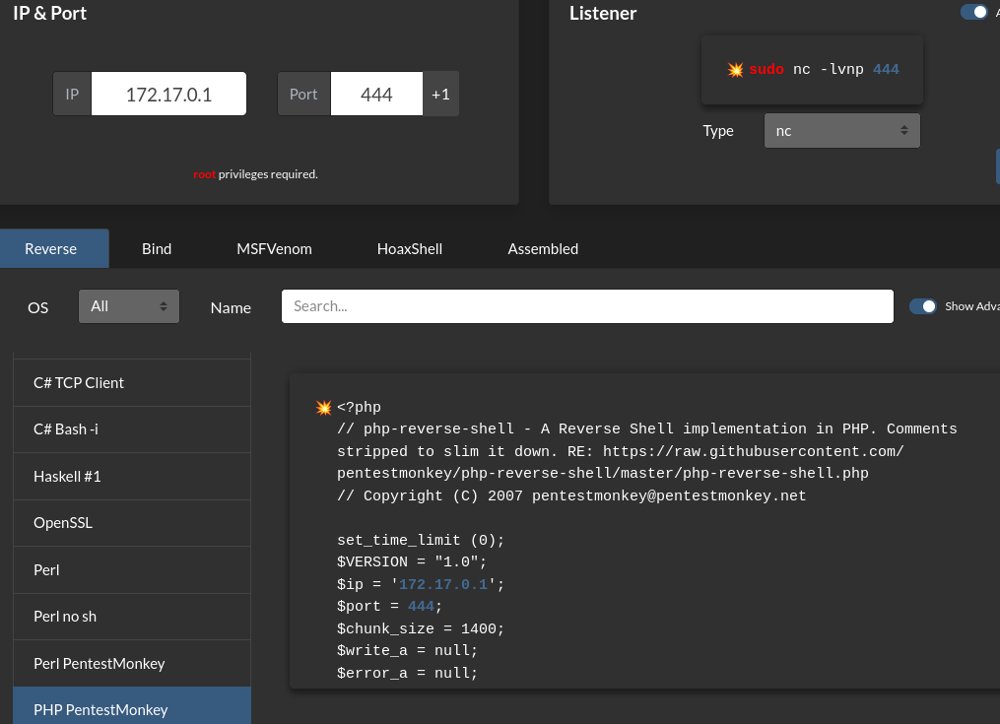
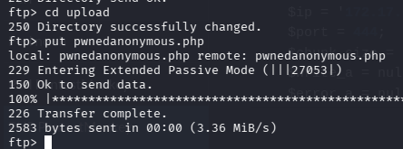
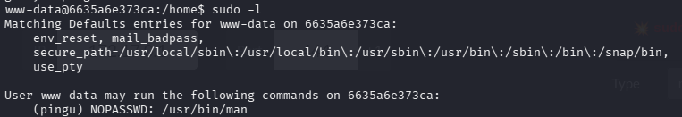
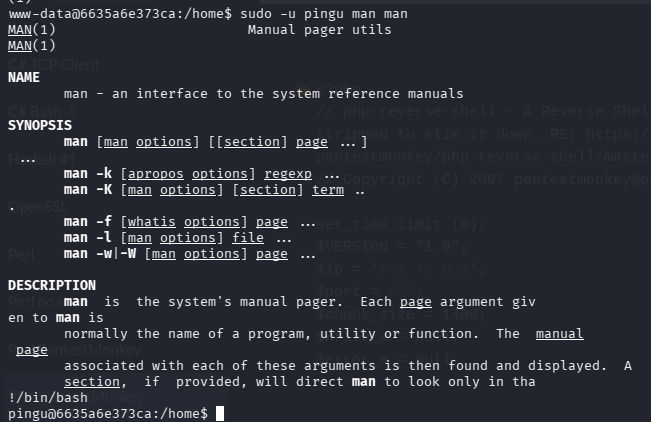
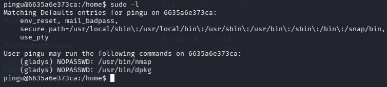
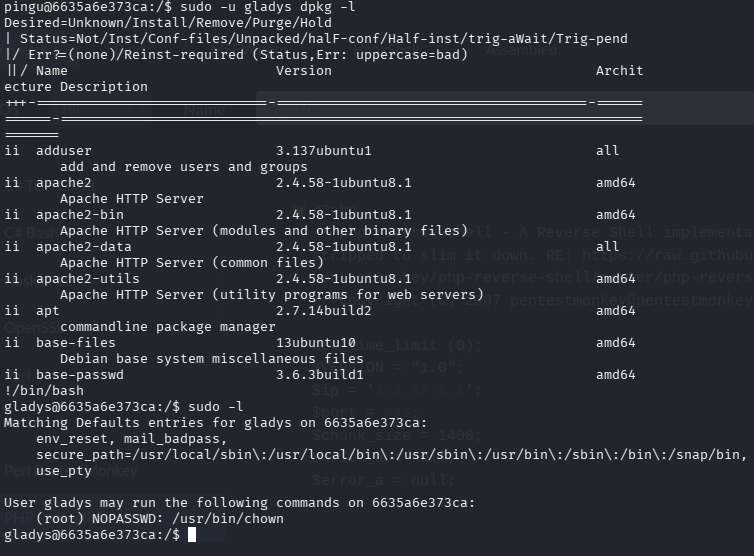
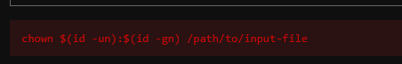
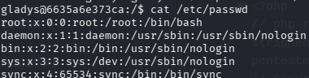
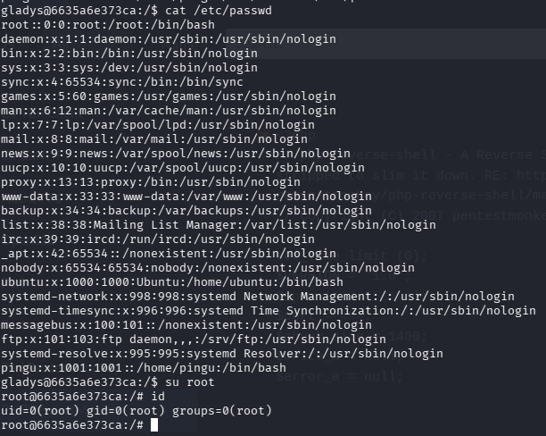

# AnonymousPingu

## ESCANEO DE PUERTOS

`nmap -p- -sS -sC -sV --open --min-rate=5000 -vvv -n -Pn 172.17.0.2`

vemos los puertos 21 y 80 abiertos , pero vemos que podemos acceder por protocolo ftp mediante Anonymous, como también vemos varios archivos como el upload para subir contenido.

## EXPLOTACIÓN MEDIANTE REVERSE SHELL

Entramos dentro mediante ftp Anonymous.

creamos un archivo malicioso php desde reverse shell

Dentro de upload procedemos a subirlo con put

Luego hacemos tratamiento de tty

## ESCALADA DE PRIVILEGIOS

usamos ***sudo -l*** para ver que binarios se pueden ejecutar

Vemos que pingu puede ejecutar "man"

Buscamos en GTFObins man y ejecutamos lo siguiente "sudo -u pingu man man"

y dentro !/bin/bash

Volvemos a repetir sudo -l y vemos que gladys puede ejecutar nmap y dpkg

**sudo -u gladys dpkg -l** ejecutamos el comando anterior y seguido de nuevo !/bin/bash

Entramos dentro de gladys,

y buscamos de nuevo binarios donde encontramos chown. Posteriormente lo buscamos en gtfobins.

cambiamos las carpetas finales a estas: sudo chown (id -un):(id -gn) /etc/passwd

Con esto podremos editar la carpeta /etc/passwd

La cual quitaremos la "x" de root copiando todo lo que contiene en ella.

Una vez echo esto accedemos con ***su root***.