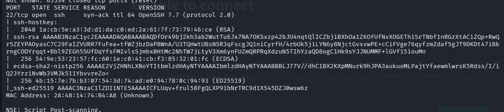
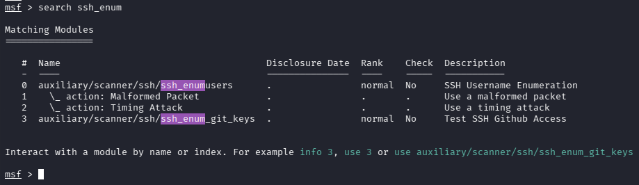
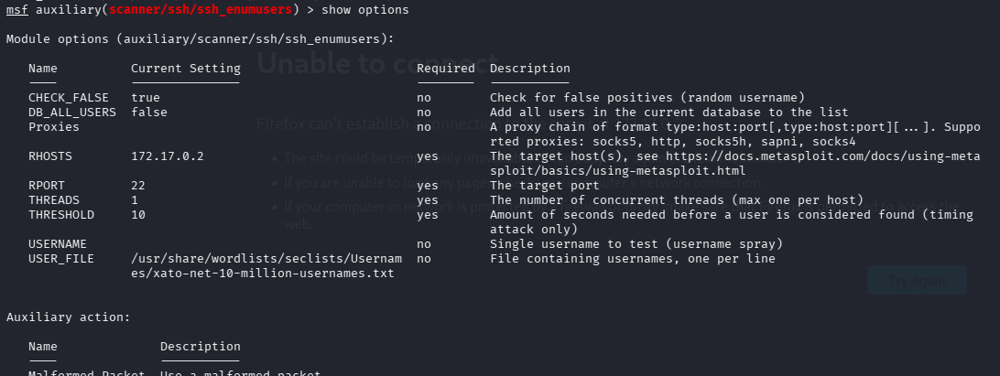
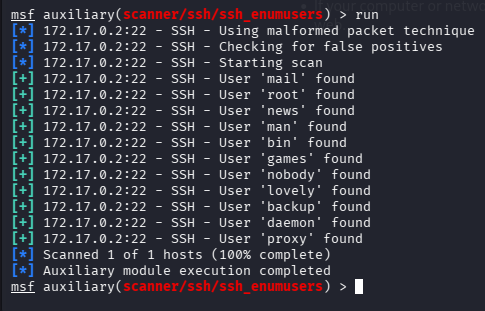
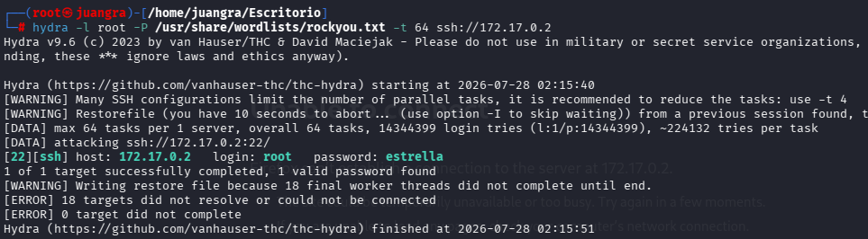
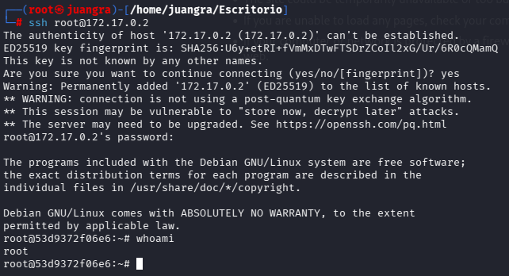

# BreakMySSH

## ESCANEO DE PUERTOS

`nmap -p- -sS -sC -sV --open --min-rate=2000 -vvv -n -Pn 172.17.0.2`

vemos el puerto 22 ssh abierto

En este caso como no tenemos referencias de usuarios y ningún dato que nos de alguna pista realizaremos desde metasploit una búsqueda de usuarios de ssh con **ssh_enum**

## BÚSQUEDA DE USUARIOS DESDE METASPLOIT PARA SSH

elegimos la primera opción "use 0"

Y rellenamos todos los datos, en este caso el RHOSTS y el USER_FILE con el diccionario correspondiente.

Una vez echo esto lo lanzamos y nos encontrará los siguientes usuarios.

## FUERZA BRUTA CON HYDRA AL PROTOCOLO SSH

Probamos con el usuario root

`hydra -l root -P /usr/share/wordlists/rockyou.txt -t 64 ssh://172.17.0.2`

conseguimos las credenciales root:estrella

hacemos la intrusión.

En este caso ya somos usuario root al entrar con estas credenciales.

En el caso de acceder con el usuario lovely, explorariamos los diferentes directorios, siendo el /opt donde encontremos un archivo hash que descifrado contiene la credencial "estrella" para subir a root."}, {"path": "dockerlabs/anonymouspingu/writeup.md", "encoding": "utf-8", "content": "# AnonymousPingu\n\n## ESCANEO DE PUERTOS\n\n`nmap -p- -sS -sC -sV --open --min-rate=5000 -vvv -n -Pn 172.17.0.2`\n\n\n\nvemos los puertos 21 y 80 abiertos , pero vemos que podemos acceder por protocolo ftp mediante Anonymous, como también vemos varios archivos como el upload para subir contenido.\n\n## EXPLOTACIÓN MEDIANTE REVERSE SHELL\n\nEntramos dentro mediante ftp Anonymous.\n\ncreamos un archivo malicioso php desde reverse shell\n\n\n\nDentro de upload procedemos a subirlo con put\n\n\n\nLuego hacemos tratamiento de tty\n\n## ESCALADA DE PRIVILEGIOS\n\nusamos ***sudo -l*** para ver que binarios se pueden ejecutar\n\n\n\nVemos que pingu puede ejecutar "man"\n\nBuscamos en GTFObins man y ejecutamos lo siguiente "sudo -u pingu man man"\n\ny dentro !/bin/bash\n\n\n\nVolvemos a repetir sudo -l y vemos que gladys puede ejecutar nmap y dpkg\n\n\n\n**sudo -u gladys dpkg -l** ejecutamos el comando anterior y seguido de nuevo !/bin/bash\n\nEntramos dentro de gladys,\n\n\n\ny buscamos de nuevo binarios donde encontramos chown. Posteriormente lo buscamos en gtfobins.\n\n\n\ncambiamos las carpetas finales a estas: sudo chown (id -un):(id -gn) /etc/passwd\n\nCon esto podremos editar la carpeta /etc/passwd\n\n\n\nLa cual quitaremos la \"x\" de root copiando todo lo que contiene en ella.\n\n\n\nUna vez echo esto accedemos con ***su root***.