# Dance-Samba

## ESCANEO DE PUERTOS

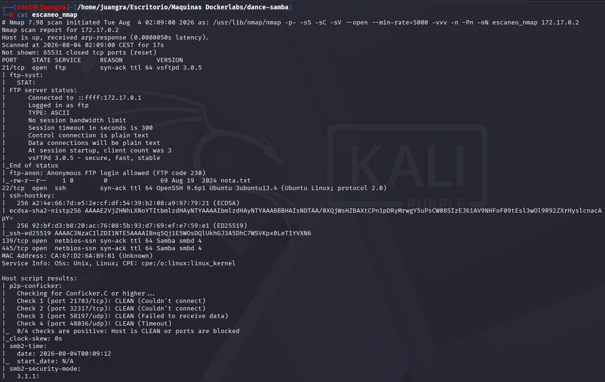

Vemos varios puertos abiertos (21,22 139,445)

## ENUMERACIÓN DE EXPLOIT

Por ftp podremos entrar con Anonymous y ver el archivo que contiene descargandolo.

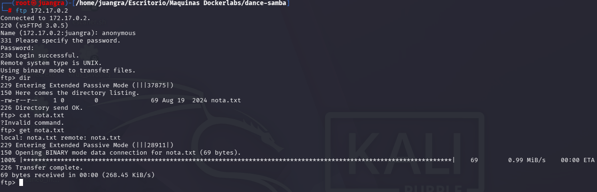

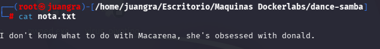

Recopilamos información de usuarios. (macarena)

Probamos smbclient para ver los recursos compartidos

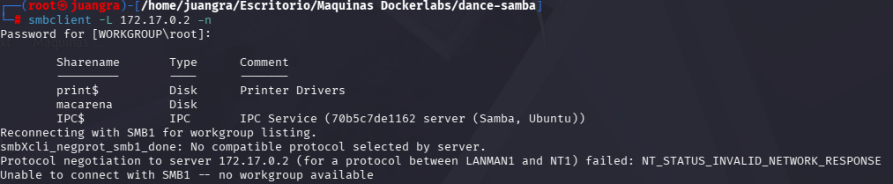

Intentamos hacer hydra pero no nos sirve ya que es una versión de SMB antigua por lo que probaremos mediante Metasploit.

Usaremos le siguiente exploit `scanner/smb/smb_login`

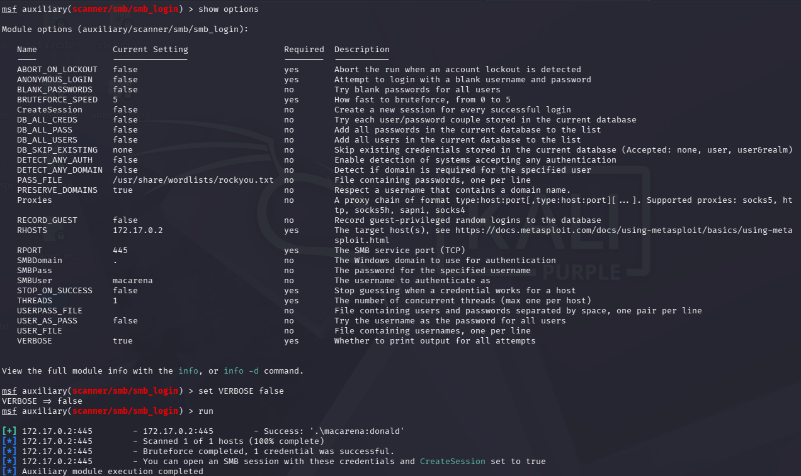

Después de una larga búsqueda nos encuentra las siguientes credenciales macarena:donald

Luego con smbmap veremos que permisos tenemos accesibles cada usuario

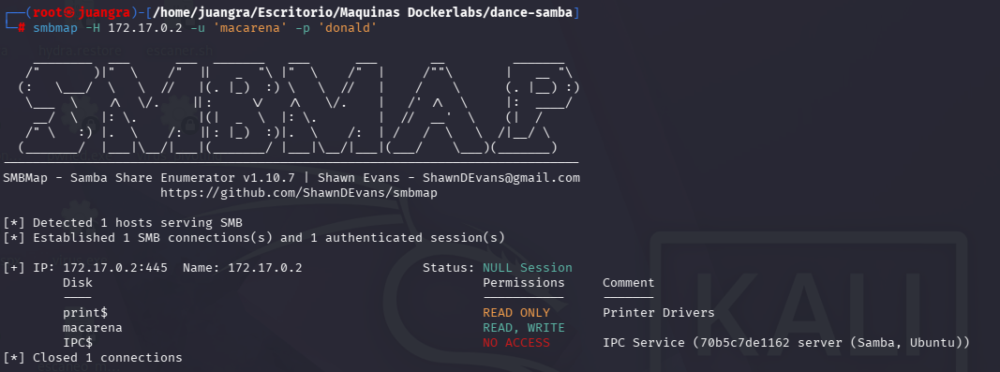

ahora mediante smbclient navegaremos por dichos archivos.

`smbclient -U 'macarena' //172.17.0.2/macarena`

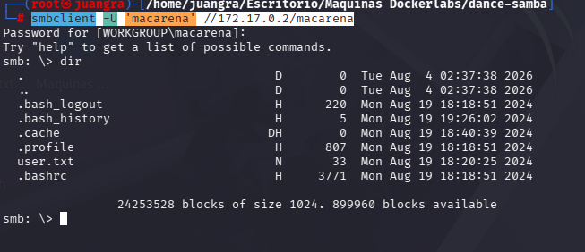

## ACCESO AL SERVIDOR

Para el acceso al servidor se realiza un ataque de SSH Key Injection, que permite autenticarse sin contraseña mediante el uso de claves SSH.

Primero, se genera un par de claves en la máquina local con `ssh-keygen -t rsa -b 4096 -f id_rsa`

Esto crea una clave privada (id_rsa) y una clave pública (id_rsa.pub).

Posteriormente, la clave pública se inyecta en el archivo authorized_keys del servidor víctima, lo que permite el acceso SSH sin necesidad de contraseña.

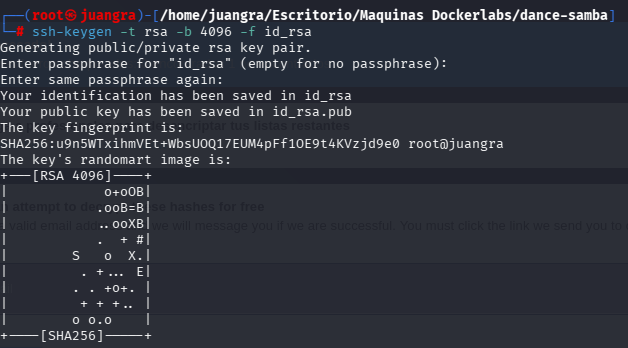

A continuación, en la máquina víctima se debe crear el directorio .ssh para almacenar la clave pública SSH y configurar el archivo authorized_keys, el cual permitirá la autenticación mediante clave pública.

Primero, se sube la clave pública generada anteriormente smb: .ssh> `put id_rsa.pub`

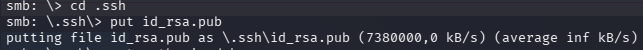

Después, en la máquina kali atacante, se copia el contenido de la clave pública al archivo authorized_keys `cat id_rsa.pub > authorized_keys`

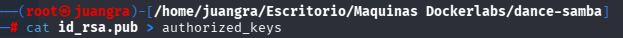

Por último, se sube el archivo authorized_keys al directorio .ssh: smb: .ssh> `put authorized_keys`

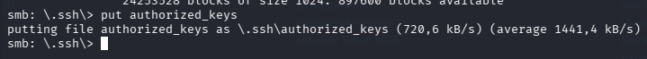

Ahora al realizar el acceso al sistema utilizando id_rsa se podrá acceder al sistema sin necesidad de autenticación

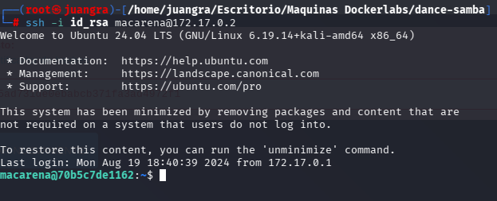

## ESCALADA DE PRIVILEGIOS

Explorando vemos los siguientes archivos

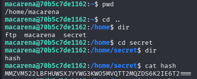

Descifraremos el hash mediante la web de cyberchef

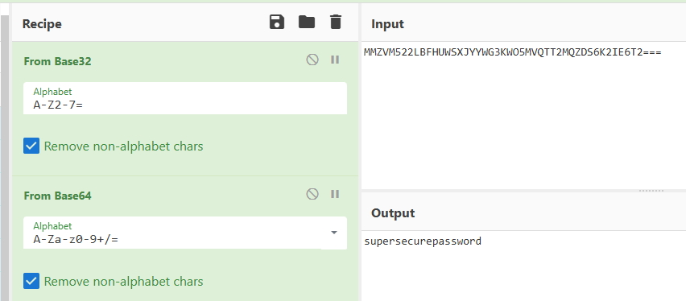

Ahora con esto si podremos ver que binarios podemos ejecutar con sudo -l

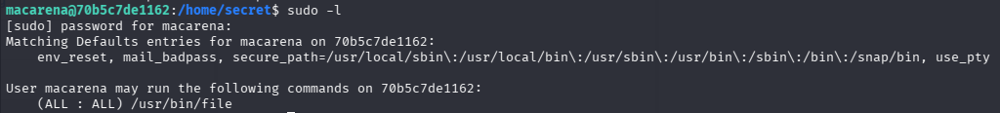

Abrimos el siguiente archivo dentro de /opt

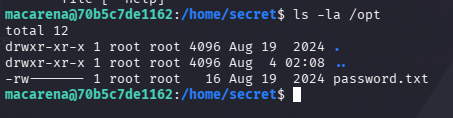

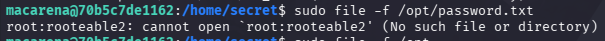

y encontramos las credenciales de root

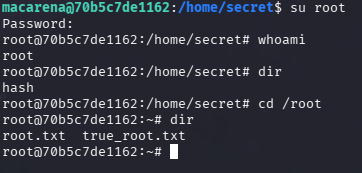