# FindYourStyle

## ESCANEO DE PUERTOS

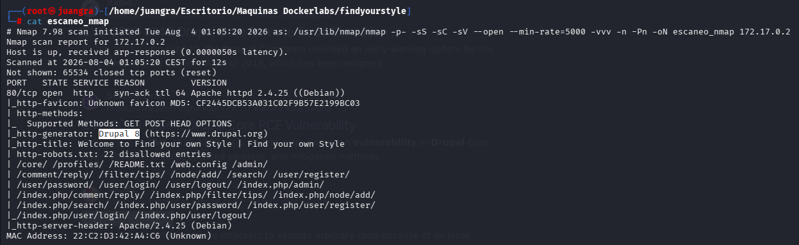

Identificamos que es un Drupal gracias al escaneo.

## ENUMERACIÓN DE EXPLOIT

Tras investigar observamos el siguiente

## CVE-2018-7600

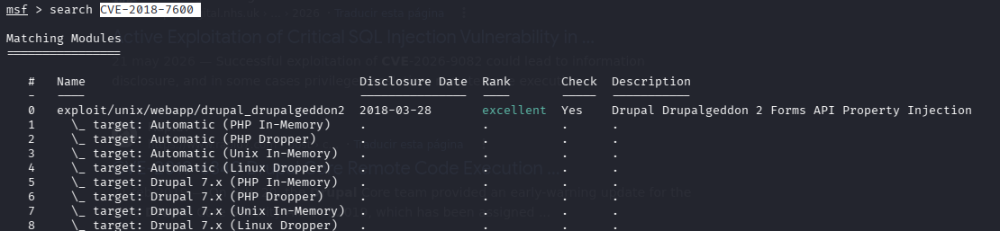

Añadimos los datos que nos pida (LHOST Y RHOSTS)

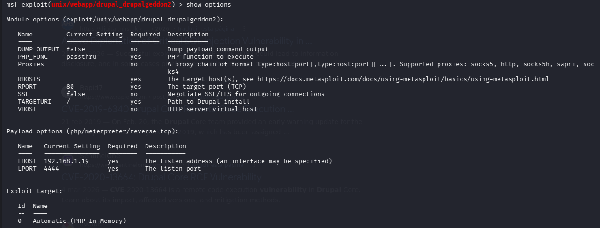

Y estamos dentro

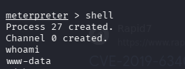

## ESCALADA DE PRIVILEGIOS

Con este comando podremos tener una shell más comoda **script /dev/null -c bash**

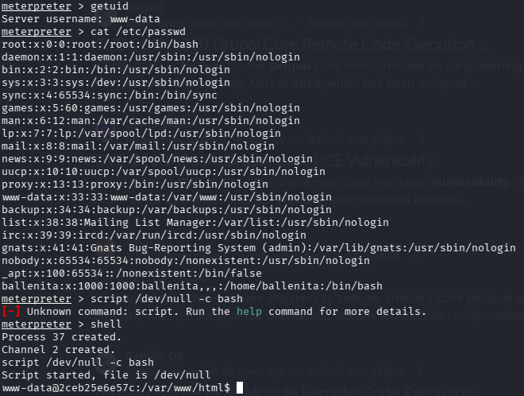

Vemos que existe un usuario llamado ballenita

También buscamos los binarios

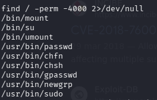

Utilizaremos el binario su para intentar cambiar de usuario.

Para ello buscaremos la contraseña de “ballenita”

Investigaremos todos los directorios.

Se inspecciona el fichero settings.php localizado en /var/www/html/sites/default

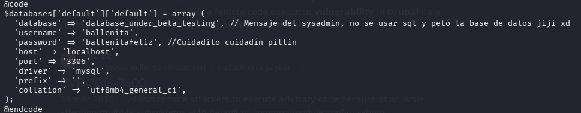

Encontramos aquí las credenciales ballenita:ballenitafeliz

Cambiamos de usuario con su ballenita y su contraseña

Ejecutamos sudo -l para ver que binarios puede ejecutar ballenita

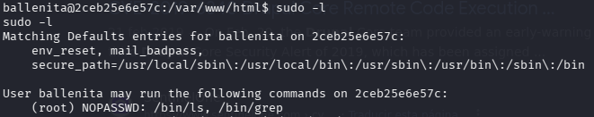

y observamos que ls y grep ambos pueden ejecutarse, por lo que buscaremos

`sudo ls -la /root`

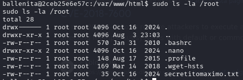

Y para ver el contenido de cualquier archivo añadiremos a grep “” para que nos muestre todo lo que contiene.

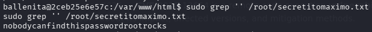

Y ahora si entramos como root.

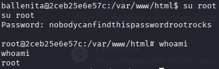