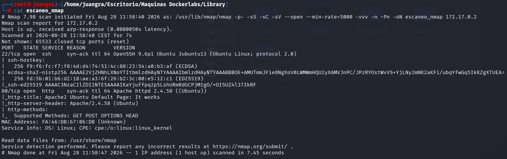
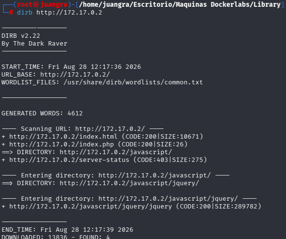
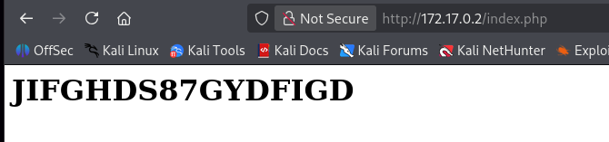
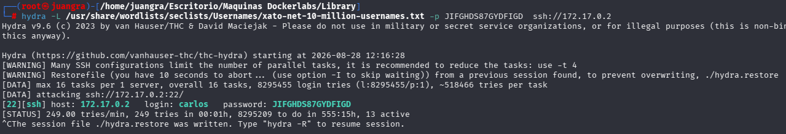
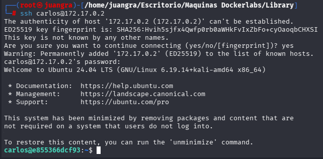
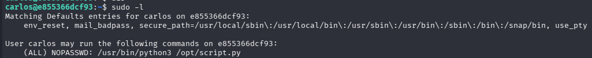
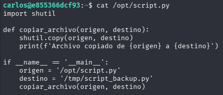
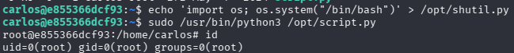

# Library

Máquina para explotar la vulnerabilidad Python Library Hijacking.

## ESCANEO DE PUERTOS

Realizamos escaneo de directorios con dirb y gobuster.

Encontramos lo siguiente en el index.php

Vemos como una especie de contraseña que usaremos para realizarle fuerza bruta

## ENUMERACIÓN DE EXPLOIT

Le hacemos fuerza bruta mediante hydra al puerto 22 ssh

Vemos el siguiente usuario “carlos”

Realizamos la intrusión con dichas credenciales

Estamos dentro del usuario carlos

Usamos el comando sudo -l para ver si hay algún binario que carlos pueda ejecutar

Observamos que podemos usar el siguiente comando sin privilegios

Vemos que contiene el script

Vemos que hay un import el cual recorre los elementos del directorio por orden de prioridad y se queda con el primero que encuentra ejecutandolo y finalizando así su tarea.

Por ello crearemos un archivo malicioso de python que nos invoque una shell como root(previamente vimos que teniamos permisos de escritura en /opt )

`echo 'import os; os.system("/bin/bash")' > /opt/shutil.py`

Al ejecutar el script nuevamente alcanzaremos ser root

