# Vulnerame

## ESCANEO DE PUERTOS

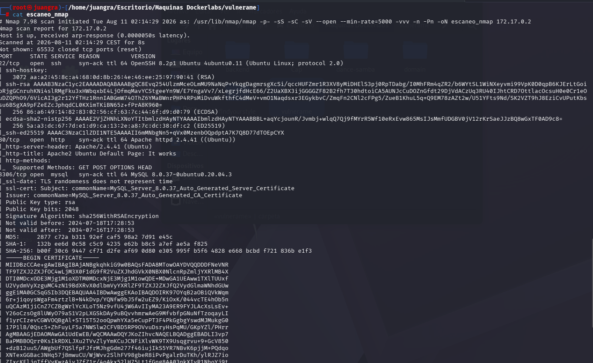

Realizamos el descubrimiento de directorios ocultos con gobuster

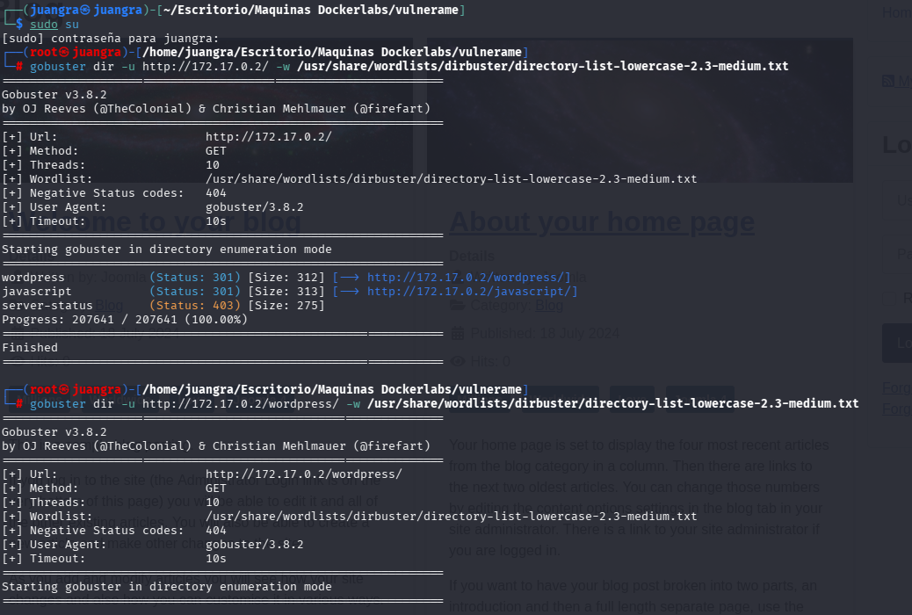

Realizamos fuzzing con dirb también y vemos más información de la que destacamos la url terminada en robots.txt

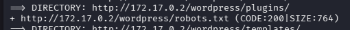

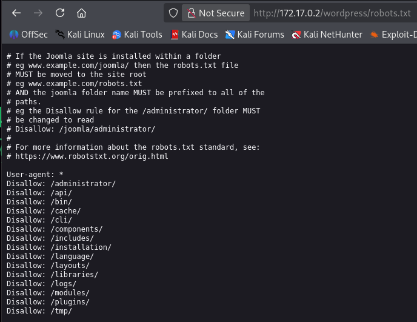

Buscamos la versión de joomla en internet y encontramos la siguiente web

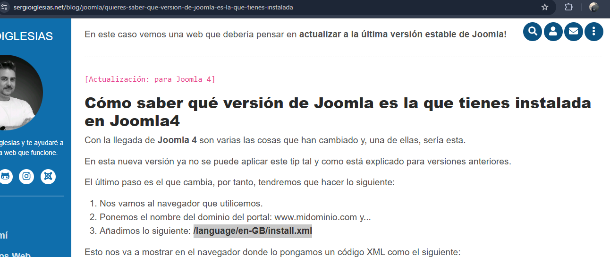

Añadimos eso a la url y nos mostrará lo siguiente

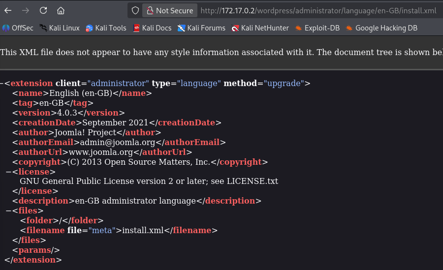

Versión 4.0.3

Dentro de hacktris Investigamos y con el siguiente comando nos da la siguiente información en la terminal:

`curl http://172.17.0.2/wordpress/api/index.php/v1/config/application?public=true`

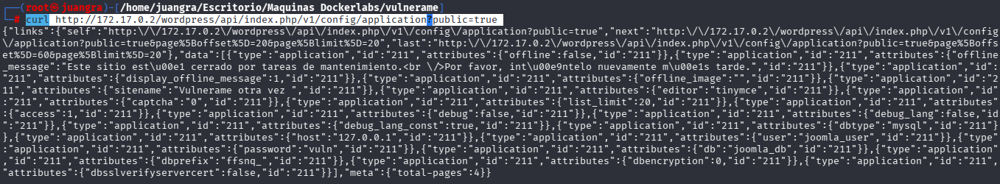

Dentro vemos las credenciales del user "joomla_user" y su password "vuln"

Con esta información haremos así la explotación

## ENUMERACIÓN DE EXPLOIT

Entramos usando mysql y las credenciales anteriores:

`mysql -u joomla_user -p -h 172.17.0.2 --skip-ssl`

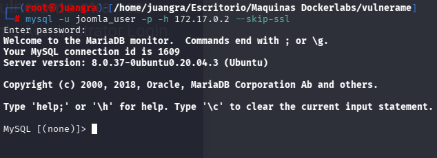

Mostramos las bases de datos disponibles

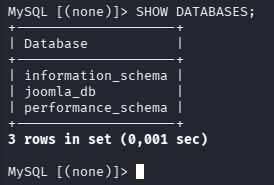

Entramos con use joomla_db y las mostramos con SHOW TABLES;

De todas las tablas entraremos en "ffsnq_users"

Seleccionamos que nos muestre toda la información con:

`SELECT * FROM ffsnq_users;`

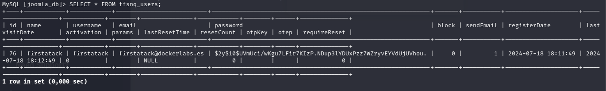

Guardamos el hash en un archivo txt y lo desencriptamos con john the ripper

`john --format=crypt --wordlist=/usr/share/wordlists/rockyou.txt hash.txt`

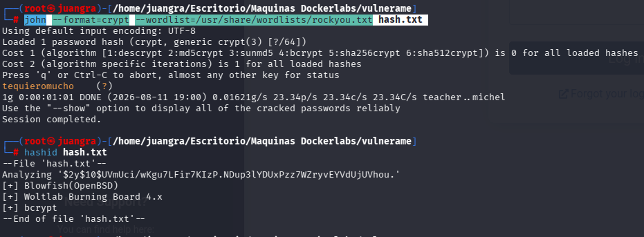

También podemos usar hashid para identificar el tipo de hash

Como vemos la contraseña es "tequieromucho" por lo tanto tenemos las siguientes credenciales firstatack:tequieromucho

Accedemos a la web con dichas credenciales

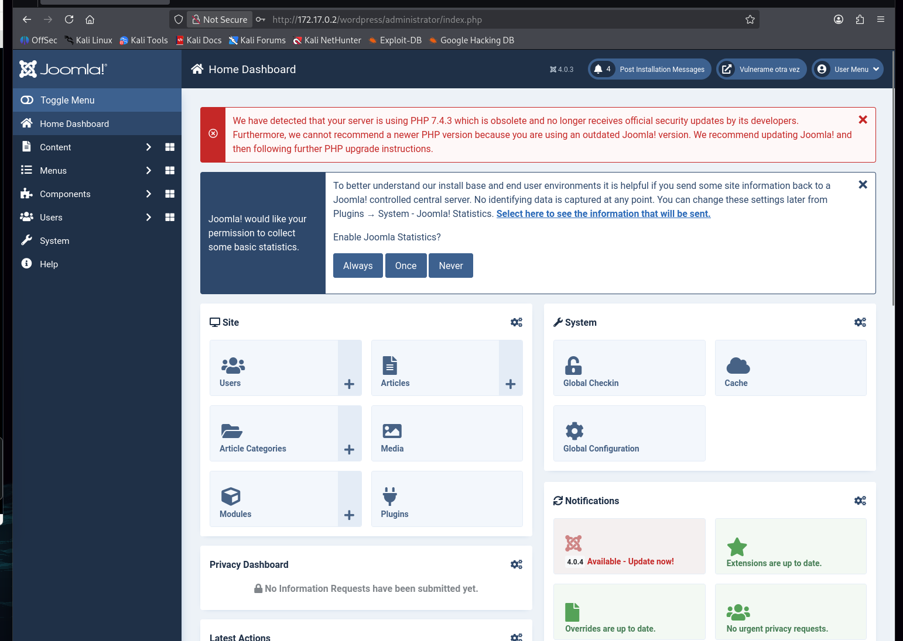

Investigamos y nos dirigiremos a la siguiente ruta:

http://172.17.0.2/wordpress/administrator/index.php?option=com_templates&view=template&id=210&file=L2luZGV4LnBocA%3D%3D

Dentro cambiaremos el código por el que creemos en Reverse shell de PHP

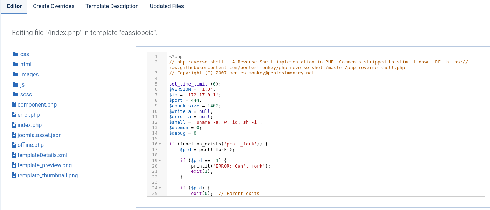

Abrimos un canal de escucha en netcat por el puerto que hemos puesto "444"

Recargamos la página en la siguiente url: http://172.17.0.2/wordpress/ y ya estaremos dentro

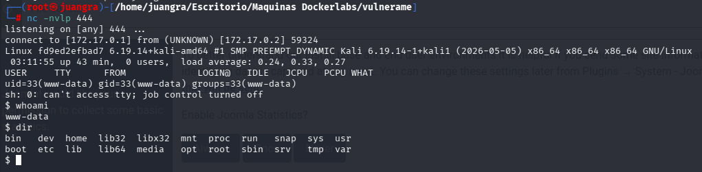

Realizamos tratamiento de TTY

## ESCALADA DE PRIVILEGIOS

Una vez con la TTY mejorada buscamos binarios disponibles

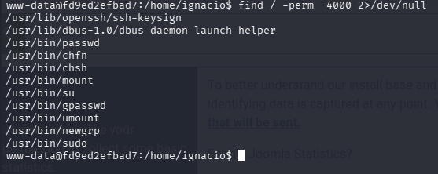

Observamos dentro de /etc/passwd que existen 2 usuarios "ignacio y guadalupe" a parte del usuario root.

Realizaremos un ataque de fuerza bruta con hydra por SSH ya que conocemos los nombres de estos usuarios.

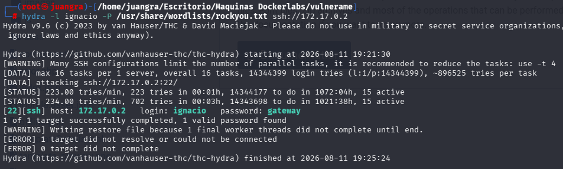

Conseguimos las credenciales ignacio:gateway

Procedemos a entrar

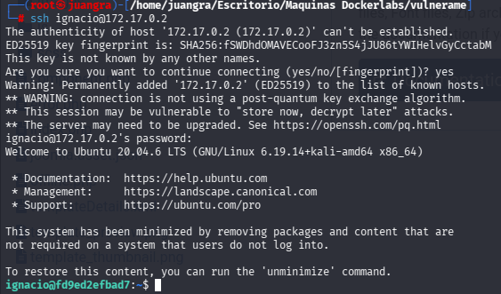

Ejercemos sudo -l para ver que binarios podemos ejecutar

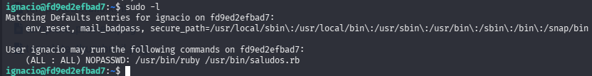

Lo ejecutamos

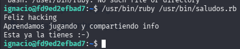

Modificamos el /usr/bin/saludos.rb y le añadimos una shell

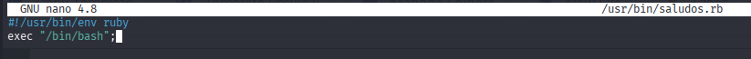

Una vez modificado lo ejecutamos con sudo y ya seremos root

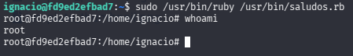
