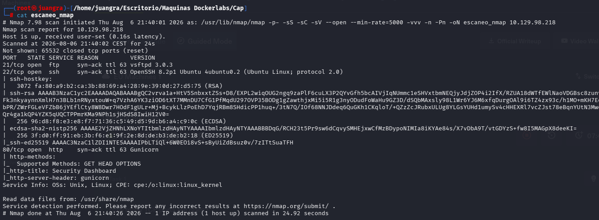
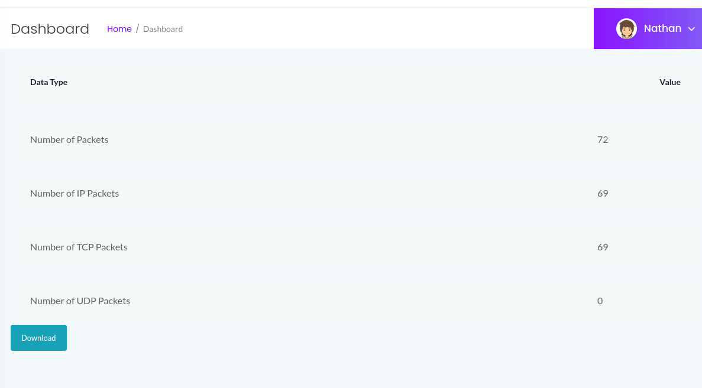
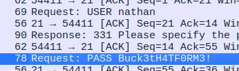
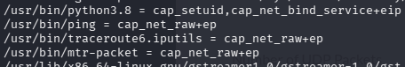
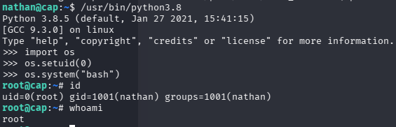

# Cap

Excelente para practicar análisis de evidencias, reutilización de credenciales y escalada por capabilities.

## ESCANEO DE PUERTOS

Entramos en la web

## ENUMERACIÓN DE EXPLOIT

Investigamos en la web y vemos que el id si lo cambiamos a 0 cambian los parámetros, descargamos el archivo y vemos con wireshark las credenciales nathan:Buck3tH4TF0RM3!

Entramos por ssh

## ESCALADA DE PRIVILEGIOS

Observamos que con sudo -l no tenemos info por lo que usamos `getcap -r /`

Luego de entre todos los output vemos lo siguiente:

python3.8 tiene capacidades especiales.

Lo usaremos de la siguiente manera para escalar a root

importamos os y en os.setuid a 0 para root y por último abrimos una bash

encontramos la flag en /root
