# Blog

Máquina donde trabajamos con CMS Wordpress y utilizamos rastreo de usuarios con smbclient, explotación de wordpress con wpscan y exploit de versión 5.0 de Wordpress.

## ESCANEO DE PUERTOS

`nmap -p- -sS -sC -sV --open --min-rate=5000 -vvv -n -Pn 10.129.148.194 -oN escaneo_nmap`

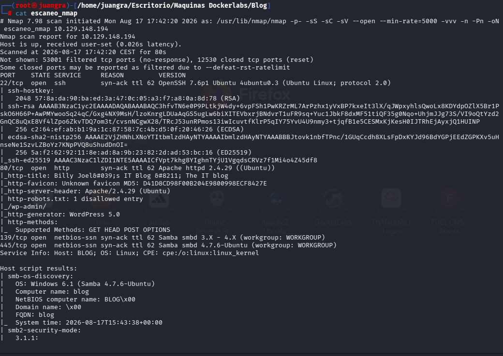

Vemos el contenido de la página pero está desconfigurada por lo que vemos el código fuente para añadir la ruta en el /etc/hosts

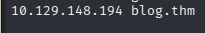

Y ahora sí sale la página correctamente

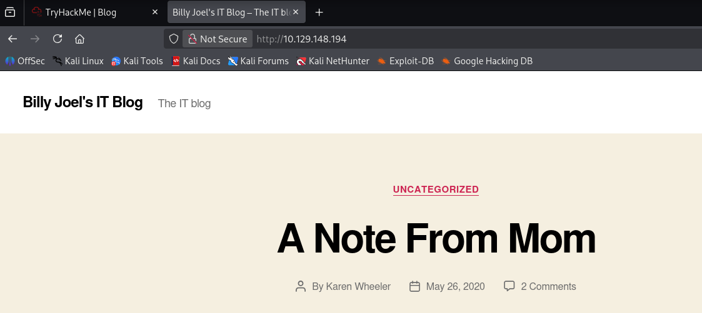

## BÚSQUEDA DE DIRECTORIOS

Realizamos búsqueda de directorios con gobuster

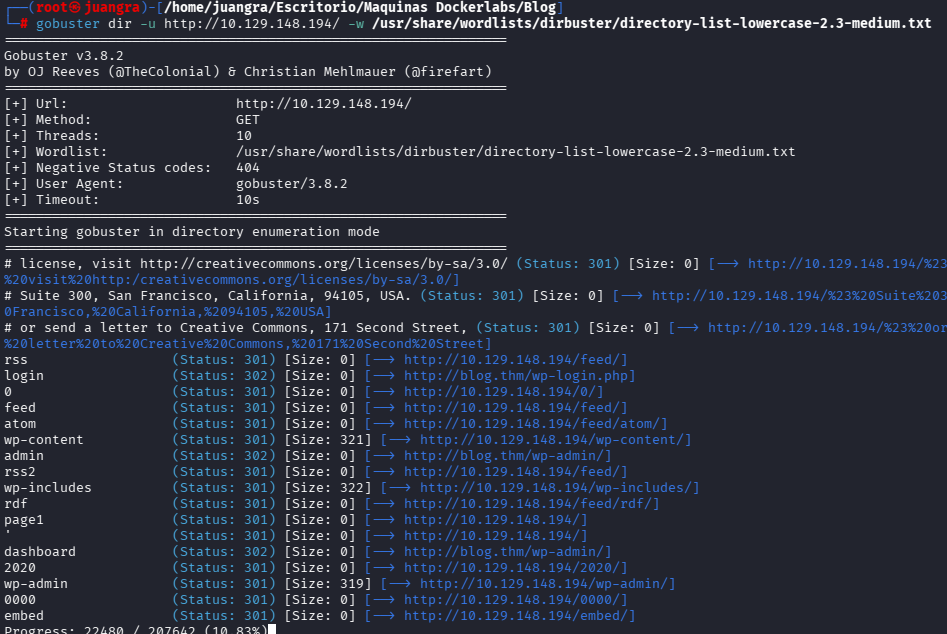

Entramos también en robots.txt

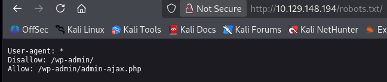

Vemos que estamos ante un Wordpress y por lo tanto vamos a buscar el panel de login y diferentes entradas.

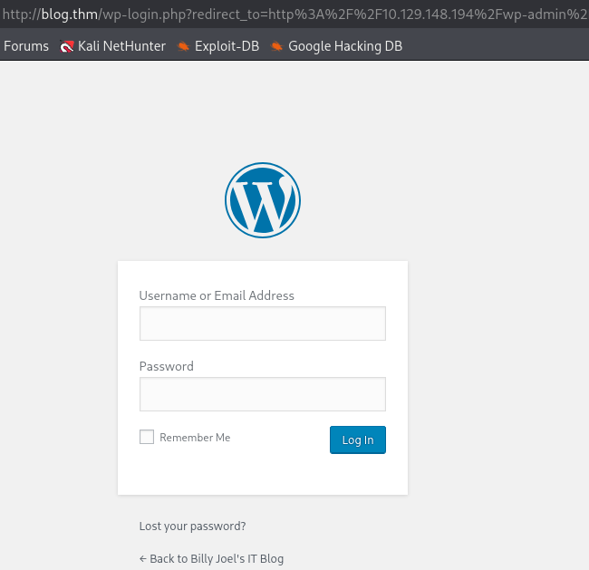

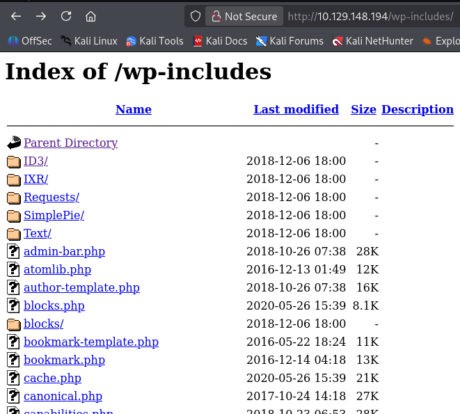

## ENUMERACIÓN DE EXPLOIT

Realizamos un SMBMAP

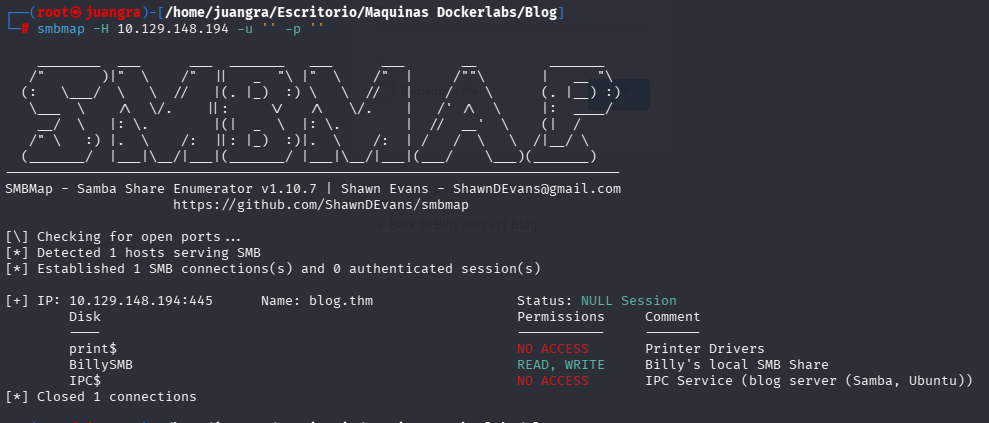

Encontramos un usuario llamado BillySMB

Usaremos Msfconsole para encontrar las credenciales para dicho usuario. Elegiremos el exploit "scanner/smb/smb_login"

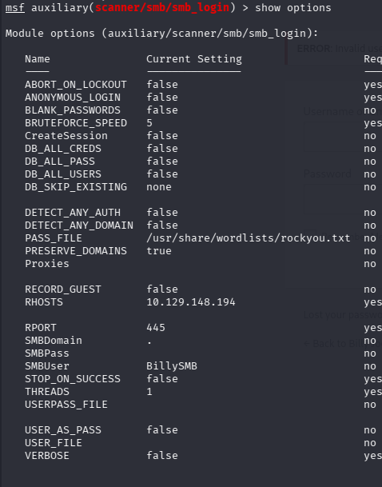

Rellenaremos el SMBUser, PASS_FILE, RHOSTS.

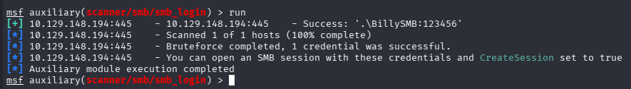

Encontramos las siguientes credenciales BillySMB:123456

Accedemos a los archivos de dicho usuario

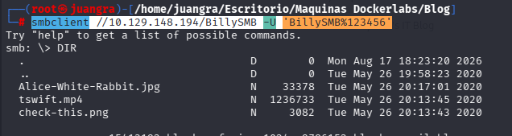

Descargamos las imagenes.

Vemos que no hay nada interesante en ellas.

Buscamos usuarios con WPScan

Identificamos los siguientes plugins y usuarios

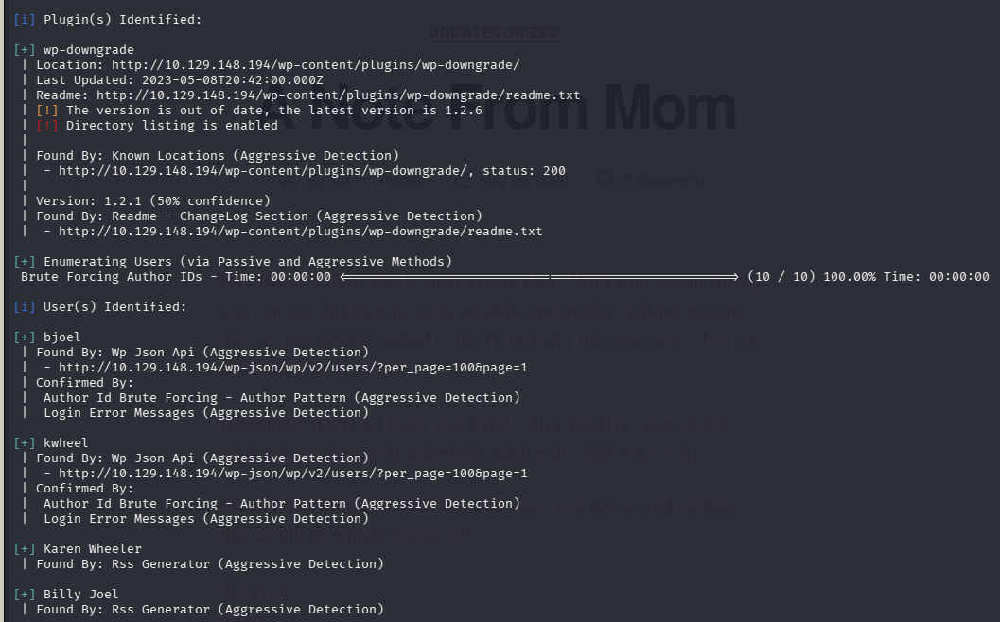

Procedemos a realizar un ataque a dichos usuarios para encontrar las credenciales.

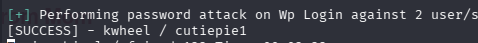

Accedemos mediante el panel de login de wordpress con estas credenciales

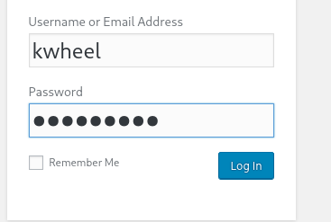

Buscamos la versión de wordpress 5.0 en msfconsole y vemos varios exploit del cual destacamos el relacionado con Crop-image

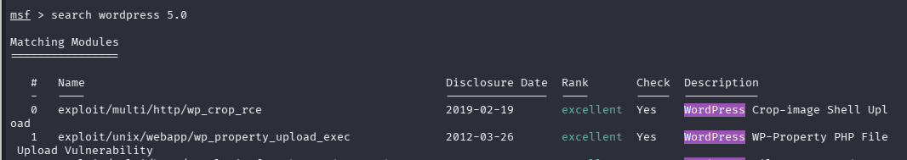

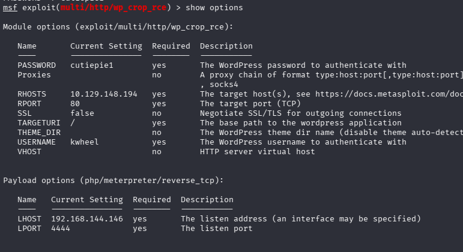

Accedemos a una sesión de meterpreter donde vemos los siguientes archivos, y en donde destacamos el wp-config.php

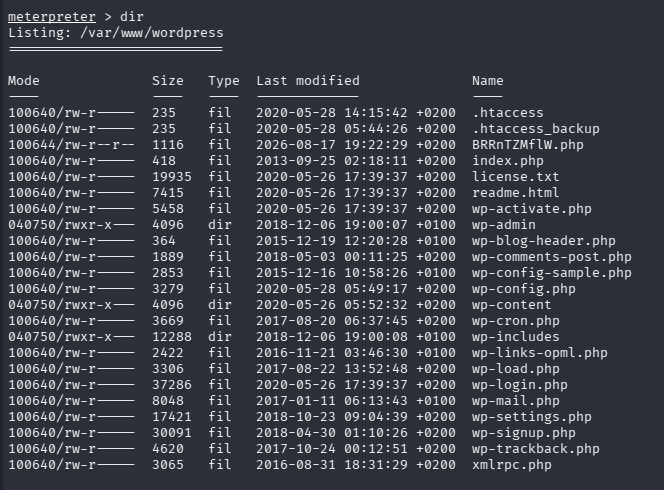

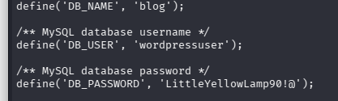

## ESCALADA DE PRIVILEGIOS

Ahora para cambiar de meterpreter a una shell más manejable haremos lo siguiente.

Cambiamos a shell y luego ejecutamos el siguiente comando.

`python -c 'import pty; pty.spawn("/bin/bash")'`

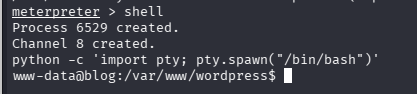

Vemos los binarios disponibles y destacamos el "checker"

Lo ejecutamos y nos sale lo siguiente

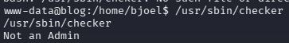

Ejecutamos ltrace para ver que ocurre por detrás.

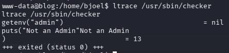

En este caso llaman a admin pero como no existe pues manda el mensaje de Not an Admin.

Por ello igualaremos admin=hello para que se valide.

Nos situamos dentro de /usr/sbin y lanzamos lo siguiente

`export admin=hello`

`checker`

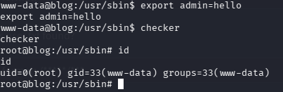

Y ya seremos root.

Buscamos el root.txt y user.txt

`root.txt`

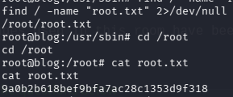

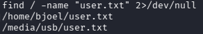

`user.txt`

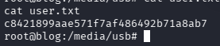
