# Ignite

## ESCANEO DE PUERTOS

`nmap -p- -sS -sC -sV --open --min-rate=5000 -vvv -n -Pn 10.130.137.26 -oN escaneo_nmap`

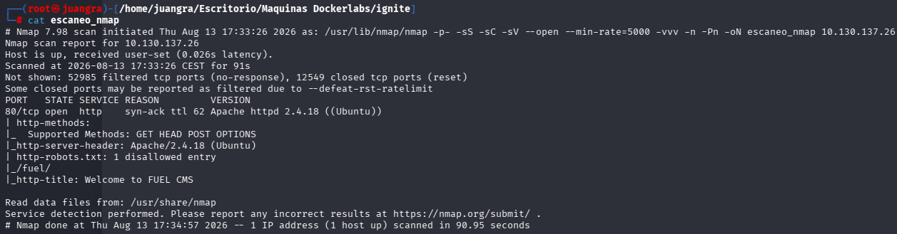

## BÚSQUEDA DE DIRECTORIOS

Hacemos búsqueda de directorios y observamos el acabado el "fuel" que nos redirige a un panel de login.

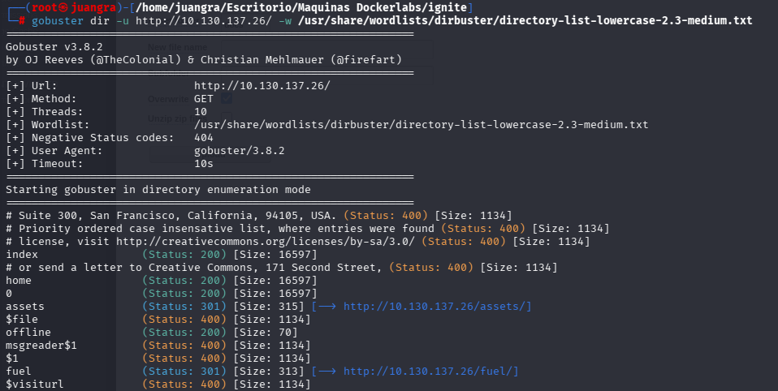

A este panel podemos también encontrarlo si entramos en el robots.txt

Entramos probando las credenciales admin:admin

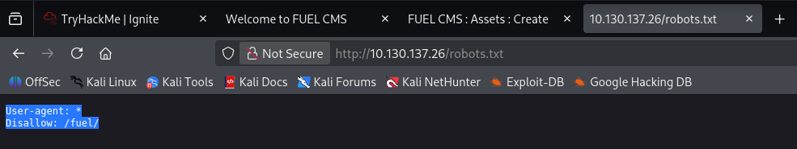

## ENUMERACIÓN DE EXPLOIT

Trasteamos la web y dentro del apartado assets vemos que podemos subir archivos.

Probamos y vemos que no nos deja subir ningún archivo PHP, pero observamos que archivos comprimidos si los aceptas.

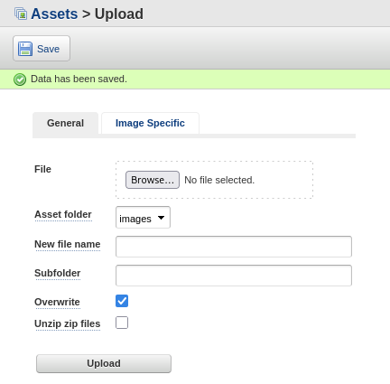

Probamos a subir un .zip que contiene en su interior una reverseshell.php

Abrimos un netcat: `nc -nvlp 444`

Y ejecutamos la url de nuestro archivo y estaremos dentro.

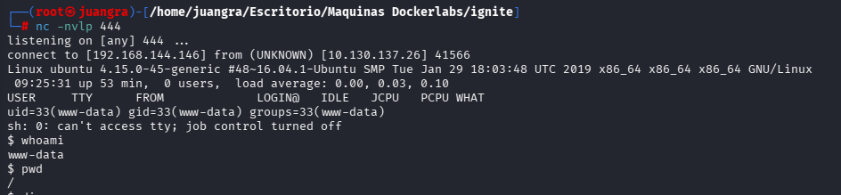

Buscamos la primera flag: `find / -name "flag.txt" 2>/dev/null`

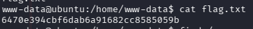

## ESCALADA DE PRIVILEGIOS

Buscamos los binarios para ver cual nos muestra

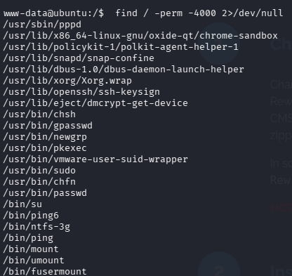

Investigamos cual puede ser más vulnerable, a priori, el pkexec pero no encontramos nada.

En la web había un apartado sobre un archivo llamado database.php por lo que lo buscamos y vemos que contiene.

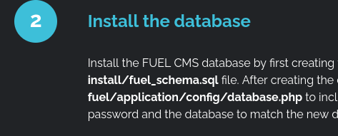

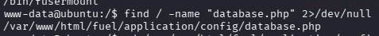

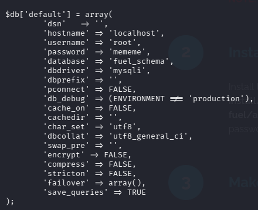

Vemos que contiene la siguiente información sobre el usuario root. Por lo que ya podremos acceder a ello.

Tras haber echo el tratamiento de TTY accedemos a usuario root y buscamos la root.txt

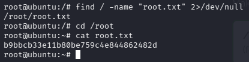
