# Pepìnillo Rick

## ESCANEO DE PUERTOS

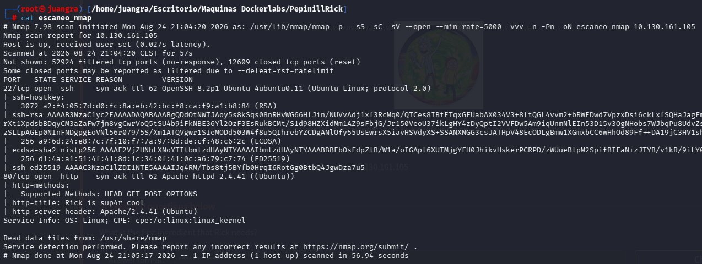

Entramos en el puerto 80 para ver su contenido

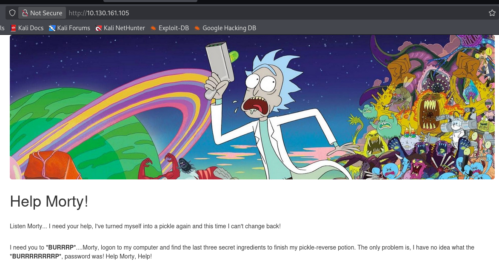

Entramos al código fuente y vemos la siguiente información

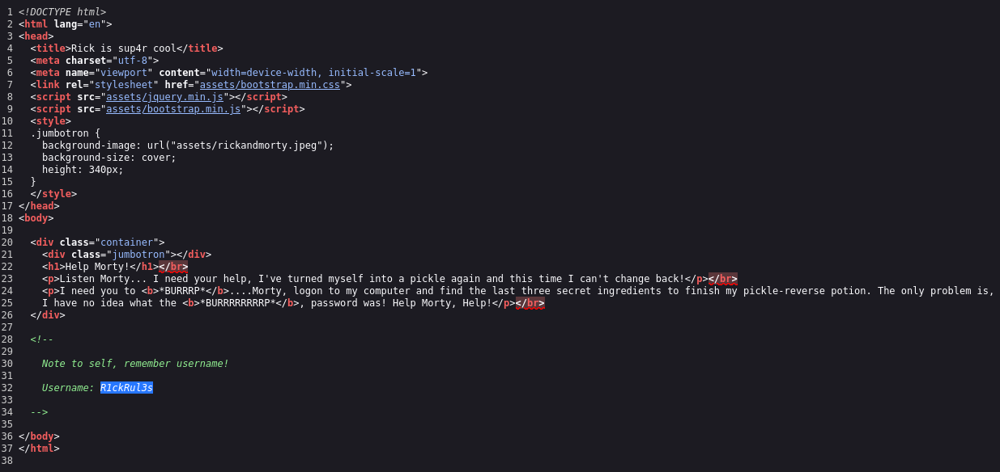

Username: R1ckRul3s

También haciendo gobuster encontramos un robots.txt y un assets entre otros directorios.

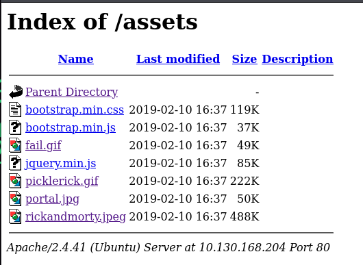

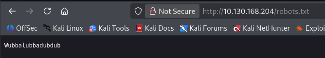

Tras problemas con la plataforma cambiamos de IP en varias ocaciones.

Encontramos también el directorio login.php, el cual nos redirige a esta página de login

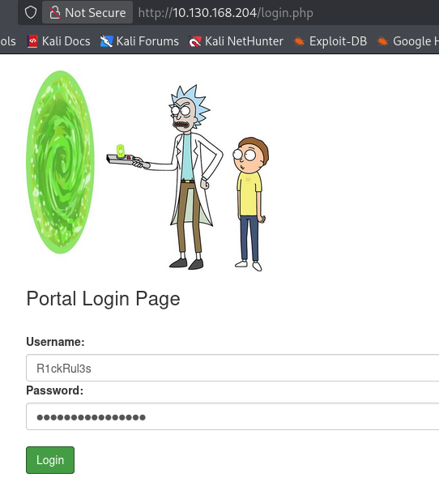

Probamos las credenciales encontradas durante la investigación R1ckRul3s:Wubbalubbadubdub y estaremos dentro

## ENUMERACIÓN DE EXPLOIT

Ahora nos encontramos una vez iniciada la sesión dentro de un panel que nos deja ejecutar comandos

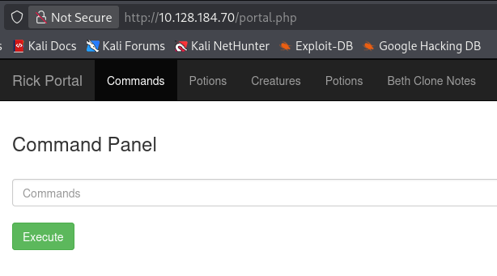

Observamos que algunos comandos se nos está restringidos

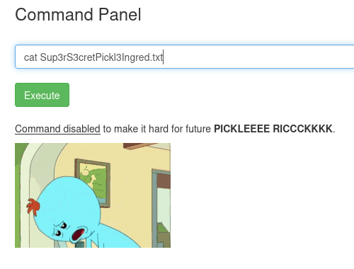

Usaremos "less" en vez de cat

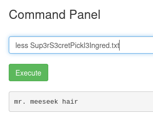

y aquí encontraremos nuestra primera flag mr. meeseek hair

Creamos una reverse shell que ejecutaremos desde el mismo panel

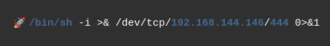

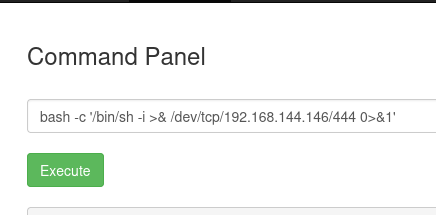

Abrimos un canal de escucha por dicho puerto y estaremos dentro

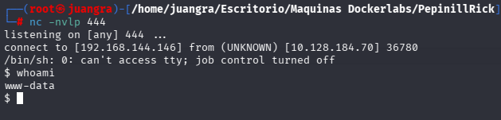

Búscamos resultados y en el perfil de Rick encontramos el segundo ingrediente

1 jerry tear

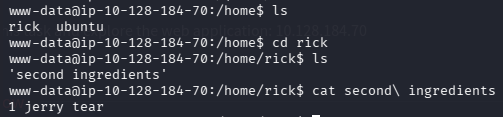

## ESCALADA DE PRIVILEGIOS

Usamos `sudo -l` para ver que binarios podemos usar

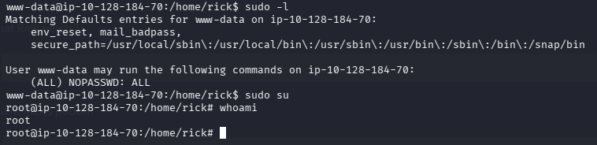

Observamos que como usuario data tenemos el poder de usar todos "ALL" y sin contraseña "PASSWORD" Por lo que usaremos `sudo su` y así escalaremos a usuario root como vemos en la imagen.

Ya por último buscamos la 3 flags de nuestra máquina, que se situa en directorio /root

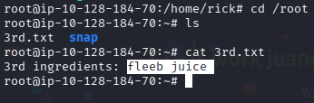