# Startup

## ESCANEO DE PUERTOS

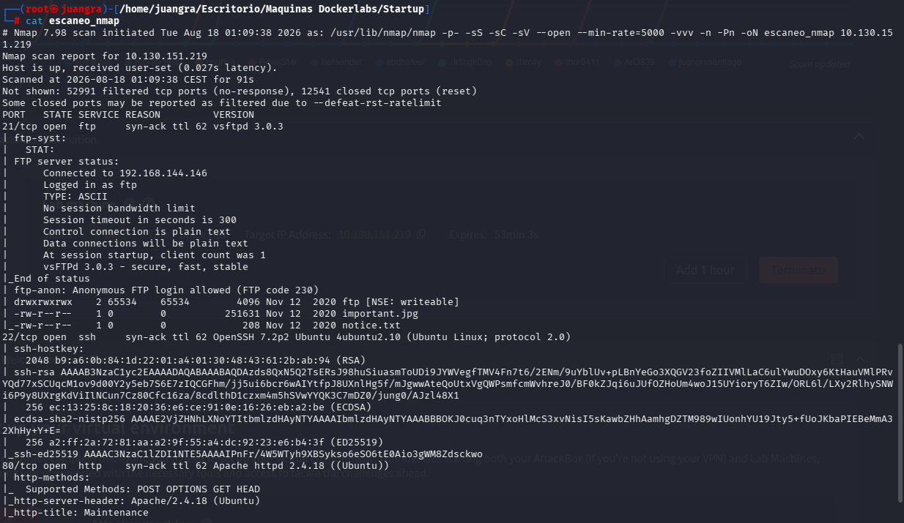

Entramos por el modo FTP con Anonymous y descargamos los siguientes archivos.

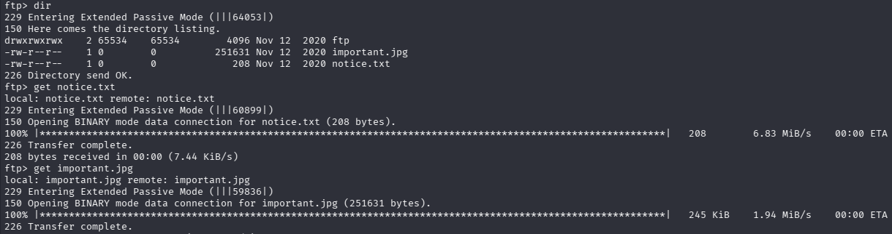

En uno de ellos vemos un nombre llamado Maya

## BÚSQUEDA DE DIRECTORIOS

Realizamos varias búsquedas de directorios y encontramos uno donde se alojan los archivos

http://10.130.151.219/files/ftp/

Probamos a realizar varias explotaciones mediante hydra y con msfconsole.

Tras ver que no funcionaban observamos que dentro de ftp hay un directorio llamado ftp que dentro es modificable y deja subir archivos.

## ENUMERACIÓN DE EXPLOIT

Probamos a subir un archivo php, al ver que funciona creamos un archivo malicioso en la página reverse shell

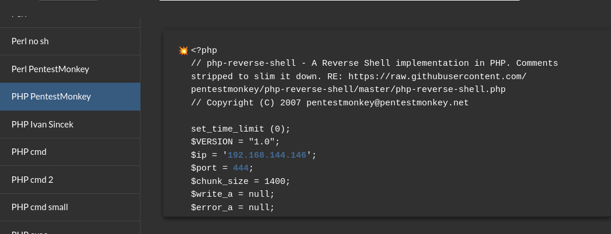

Y lo subimos

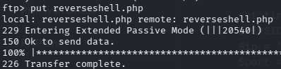

Al extraerlo desde el navegador y previamente habiendo abierto un canal de netcat estaremos dentro.

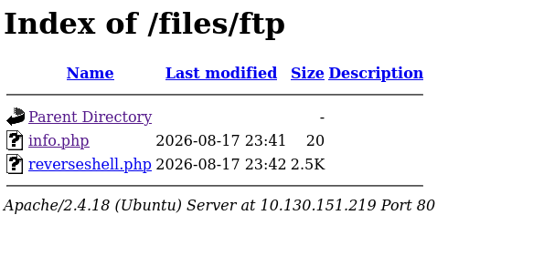

Realizamos el tratamiento de TTY

Investigamos y observamos que existe un usuario llamado lennie

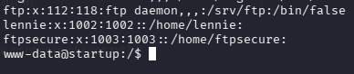

Descubrimos también un archivo .pcap el cual mandaremos a la ubicación del ftp para descargarlo y con wireshark analizarlo.

`cp suspicious.pcapng /var/www/html/files/ftp/`

Entramos dentro del archivo y vemos un intercambio de información entre el puerto 40934 y el 4444

Pinchamos en un paquete de estos y le damos a "Seguir" y nos muestra los últimos movimientos de los cuales vemos las credenciales usadas por lennie.

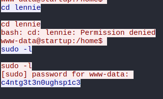

Probamos por SSH dichas credenciales lennie:c4ntg3t3n0ughsp1c3

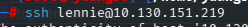

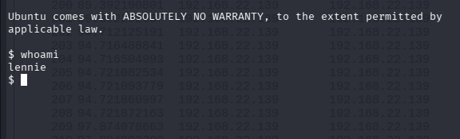

Realizamos de nuevo tratamiento de TTY

## ESCALADA DE PRIVILEGIOS

Buscamos los binarios disponibles

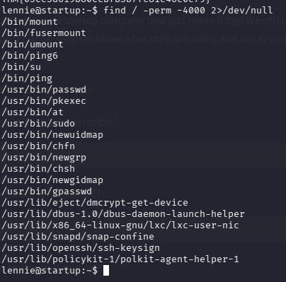

Observamos que existe un directorio llamado scripts al cual accedemos y vemos un archivo planner.sh que redirige a un ejecutable print.sh en otra ruta

A este último archivo le añadiremos una reverse shell para que se nos abra una shell en root.

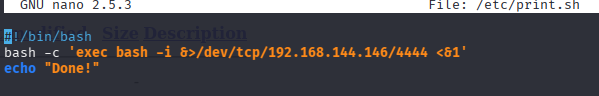

Indicamos nuestra ip y puerto y la lanzamos. Despues abrimos el netcat por el mismo puerto

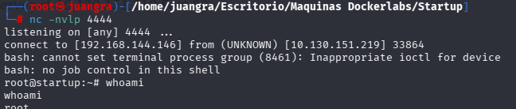

Y ya seríamos root.

Ya solo debemos buscar la flag root.txt

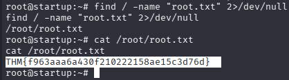